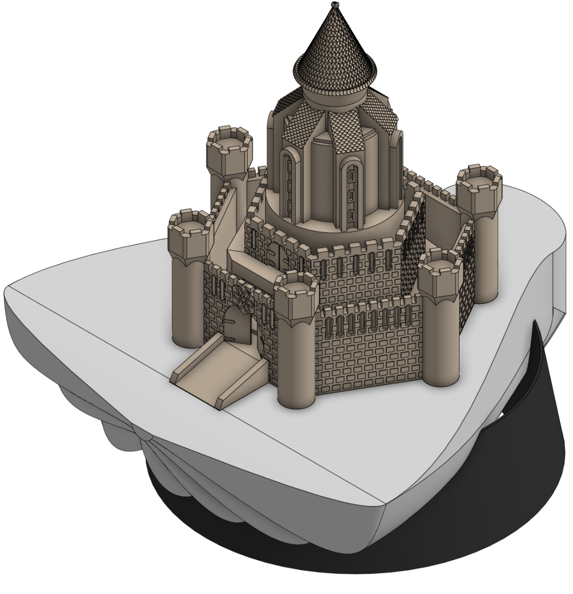
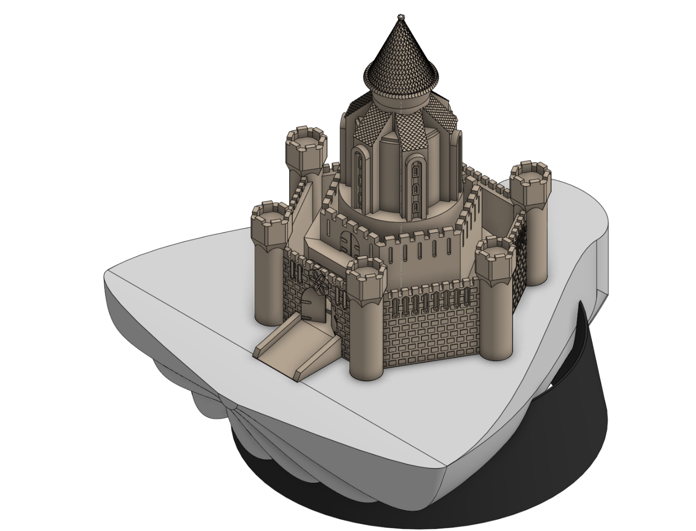
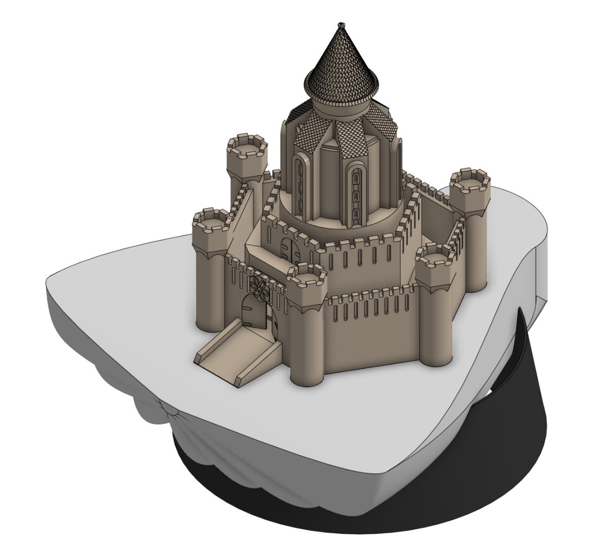
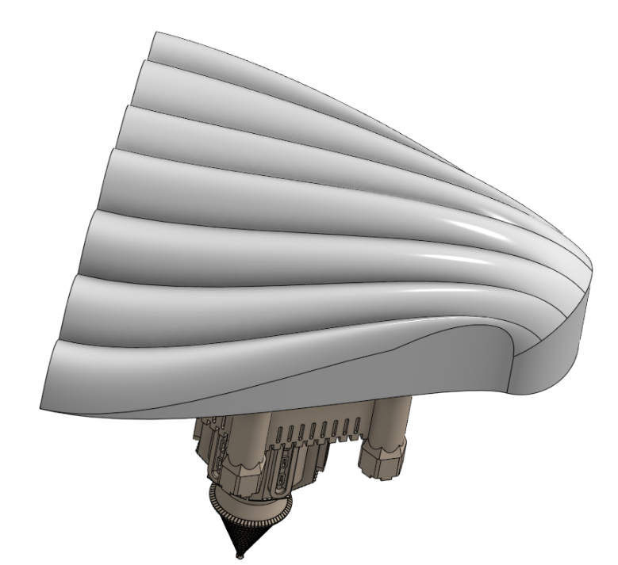
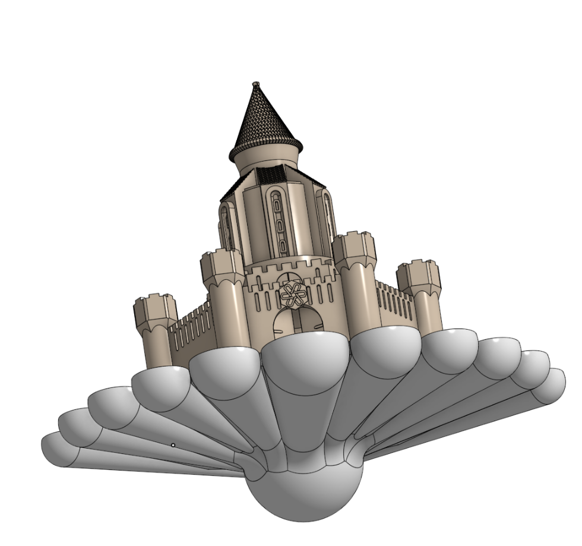
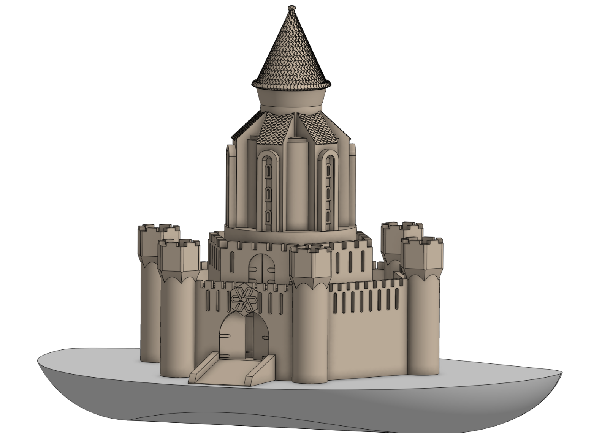
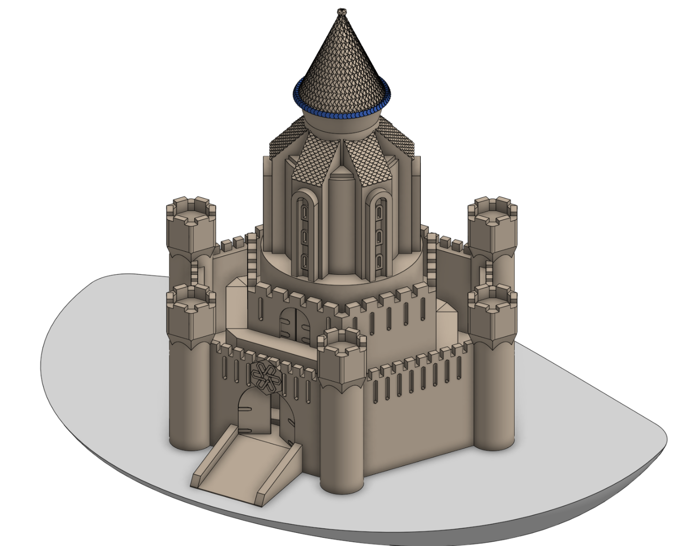
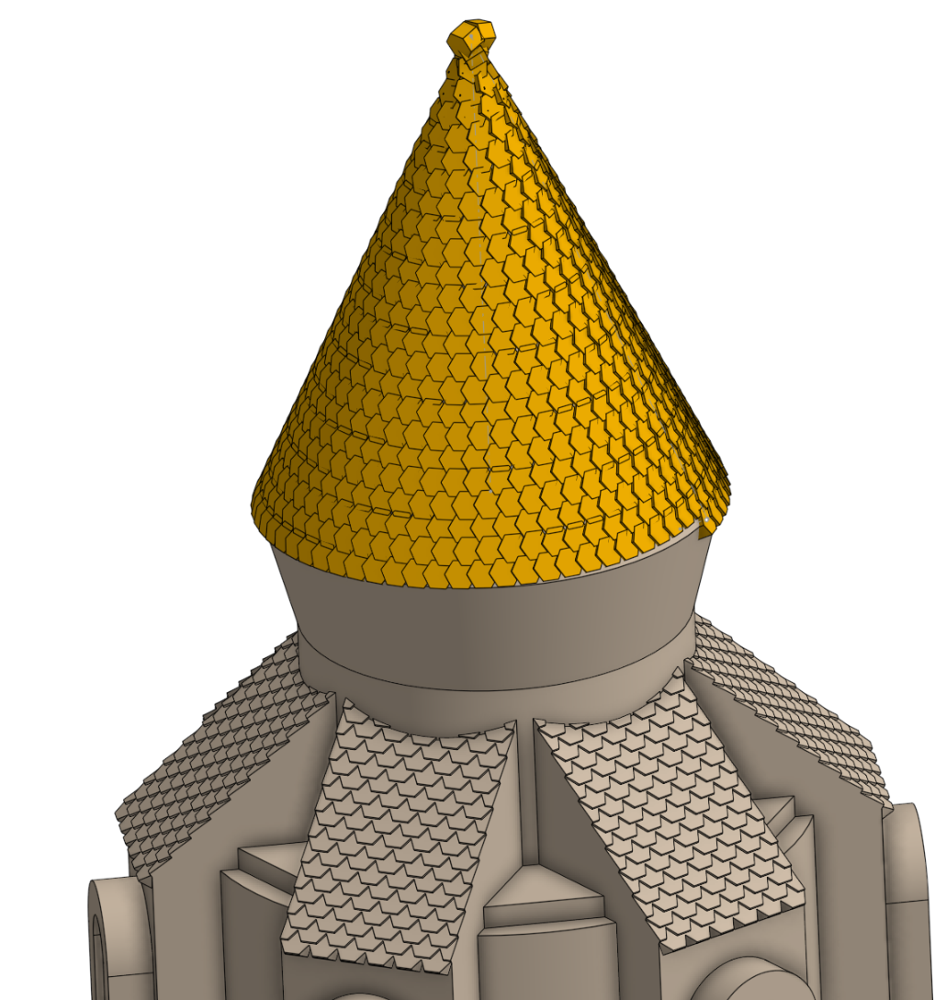
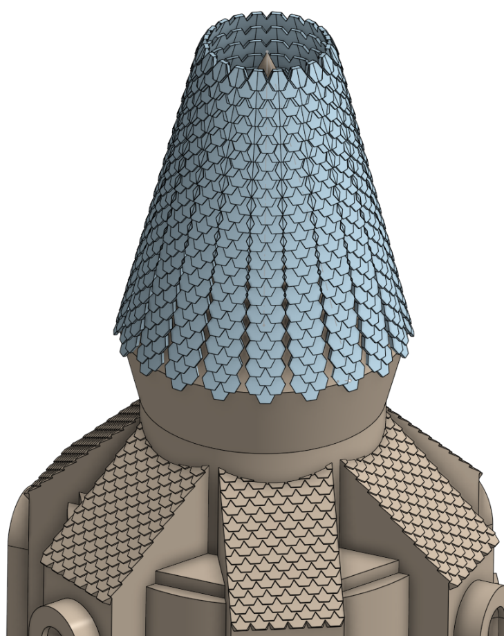
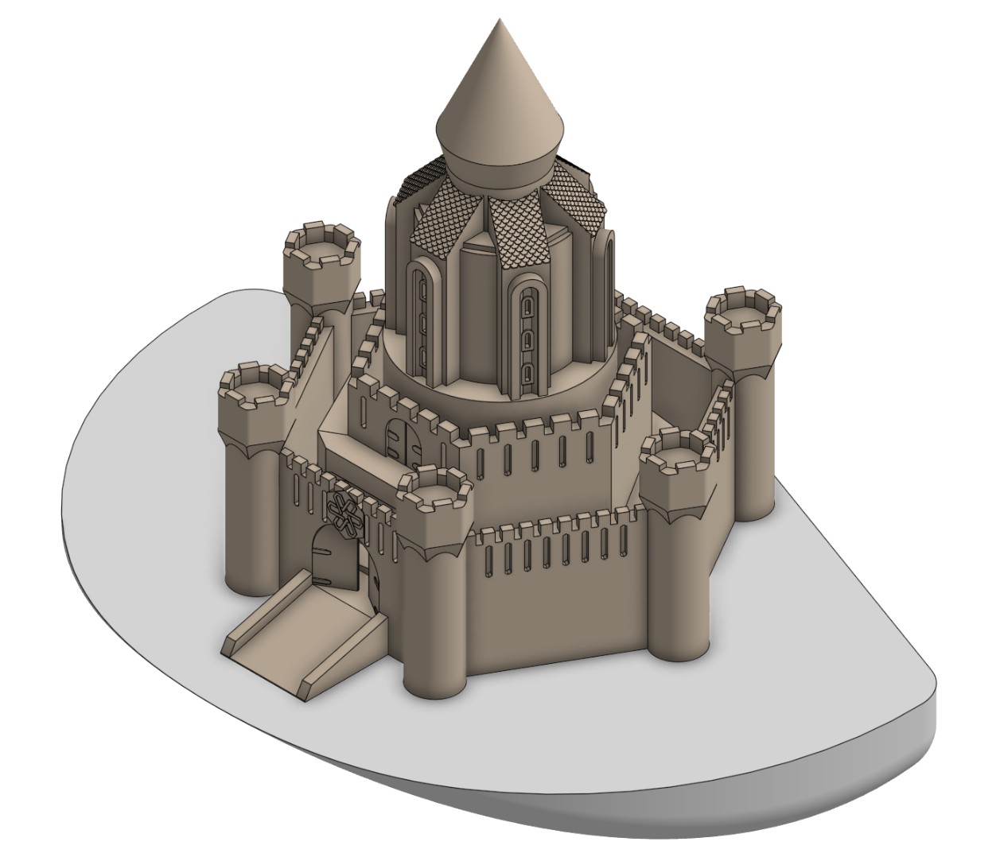

# Journal

# 1/19/26 - 59

I finished the bricks on the castle, which was a long and a little bit irritating process. Onshape was being difficult and slow due to the model having so many parts, and so it took some time to select all the bricks to extrude. The first set took the longest because there was one single brick causing a non manifold edge, and I had to individually select each brick to find which one it was. Afterword's for the remaining walls I could just deselect that single brick, but It did take some time to find. I had thought that it was a problem with the ramps, but it turned out to be by the arrow slits. i do think that the result looks good, however. I am going to leave the circular parts smooth, as I don't think it takes anything away from the model, and they would be somewhat difficult to add bricks to.

# 1/19/26 - 37

It is about time to wrap up this project, but there are a few more details I want to add first. I started adding brick detailing to the outer walls. I would like to do all the walls eventually to make this one of my most detailed models. There were some problems with this being a somewhat last minute decision, as I had to add and extruded border around the arrow slits. I also had to do the front gates separately, as I had to work around the symbol and the gate. I ended up removing two of the arrow slits over the gate, as adding the border would run into the big hexagon, and I don't think it is missing anything by not having them.

# 1/18/26 - 27

I finished up the shell. I used an offset plane and a loft to create a curvature shape, as well as messing with the loft settings to get a more curved shape. I originally tried to use a smaller version of the shell shape as my loft, but the loft couldn't be completed, so I used a simple arc instead. I then made a stand for the shell; it is a pretty basic angled curved piece, but it is molded to fit the shape of the shell. I duplicated the shell and used it to cut the shape out of the stand.

# 1/17/26 - 44

The shell is completely redone, at it looks so much better. I had read some techniques used for shells, and decided to try using curves and lofts to create a basic shape of the shell using a surface. I then extruded the shape of the shell up to the surface to create a part with the curvature I wanted. I had some problems with having an edge curve be curved too much so the extrude couldn't fill a piece. It took quite a bit of fiddling to get the shape just right. To make creating this easier, I didn't bother creating my shell in any way aligned with the castle. However, I need to make sure the castle still fits with he shell, so I had to flip the shell upside down, and move castle up and over until it was aligned properly

# 1/15/26 - 35

I started trying to work on the clam shell the castle is sitting on. I first tried to make some curves wrapping the shell, but they just didn't wrap properly. I then removed the shaping of the shell and made some curved pieces which I revolved to attempt to make the rough texture of the shell. It sort of works, but it doesn't look quite right. I may have to make a smooth shell due to the problems I am having with shaping.

# 1/15/26 - 5

This is very short, as for the time being I am finished with the castle and will be moving on to the shell now. I moved the ring down by 0.1mm and it allowed me to attach it to the castle. I then tried creating a cone and thickening it to make the top a peak, but I think that the rough nature of the top fits the design of the castle, a suddenly smooth point looks bad. before journaling I tested it in the slicer, and to my surprise, the ring doesn't require supports to print! It appears that the shingles also will be visible, at the very least there will be some texture on the roof. 

# 1/15/26 - 34

The roof is causing a little bit of trouble. I used a circular pattern to fill in some of the gaps in the shingles, but the bottom still looks pretty bad. I used a circular pattern to create a ring of hexagons around the base and thicken it so it extends past the shingles. i then extruded down and removed the shingles that would create weird artifacts beneath the outer ring. However, I still am having the problem that I can't actually attach the ring to the castle; it tells me it doesn't return a valid part. Also, Onshape was being really slow I cut about 10 minutes off my time as I spent so much of it just waiting for it to load tools.

# 1/14/26 - 15

I was researching conical roofs, and found some images of spiral shingle patterns. To give it a try, I made a helix with an arbitrary number of twelve revolutions, and curve patterned a hexagon around it. I then used a circular pattern to fill in the gaps left by the spacing on the helix. This roof looks much better, and is what I will be going with moving forwards. It has some issues such as the bottom piece not being a smooth end, and the top being quite strange, but it is so much better than the previous design I tried, and lets me keep my hexagonal shingles.

# 1/14/26 - 33

I tried to shingle the conical roof. I placed some hexagons on the cone using a cylinder and some thickens, it took a bit of messing with, but it worked quite well, then used a linear pattern to extend them. I had some problems with getting the line angle for the linear pattern just right. Trial and error got it right. I then used a circular pattern to surround the roof with tiles. It is not quite a cone, and the tiles don't all line up (I guess hexagons can't tile a cone). I like having the peak shingled, but it will need more messing with to make it look really good.

## 1/13/26 - 23

To start i made the castle 1.2x bigger. It slices better, and the small details look much better on the slightly bigger model. I also added a chamfer to the hexagon over the gate to help it print better. it does mean the gates couldn't "technically" close, but that doesn't matter with a static model. There are two supports on the front gate, but that will have to be what it is. i the started on the shell. Due to the castle being so big, I can't have a top and bottom shell that closes around the castle as I originally planned. Instead, there will be a single shell underneath the castle, which I started trying to shape. I got the front-to-back shape pretty good, but the side to side shape is just made with fillets, so I am not sure how much I like it.

## 1/13/26 - 53

I had a bunch of time to work without being able journal, so I got quite a bit done. I started by upgrading the logo over the gate to be inside a larger hexagon. It not any allows me to make the symbol bigger, but also the hexagon just looks cool. I did have the problem that I had to redo some sketches as extruding the hexagon broke them. I don't know why. I then added arrow slits to the inner wall, which wasn't too hard. The final and longest task I did was add shingles to the six angled roofs. I was originally going to do curved (terracotta-like) shingles, but during some research I saw hexagonal shingles and knew that was the right choice. After a few sketches, I used a linear pattern to finish the roof, then copied and used a circular pattern on it to copy the roof tiles to all sides.

## 1/12/26 - 44

I decorated the outer walls of the castle in this session. There were two major decorations, the first was arrow slits. I tried multiple different designs of arrow slits, straight rectangles, crosspieces, crosspieces with hexagons, and ended up with a more minimalist rectangle with pointed ends. The minimalist look fits that castle better, and I realised that they are actually hexagons (just irregular ones). I then wanted to put some detail above the main gate, as the arrow slits were to big to fit, and so did some (un-time-tracked) research into hexagon symbols, and found some I liked to inspire my design on the castle. I had some problems making the breaks in each of the connectors where I couldn't add the breaks in the design without dragging the line very close to my 1mm break, as it would say the sketch could not be solved. I then made it bigger until it could be sliced properly (although it might have to get bigger still).

## 1/12/26 - 35

I did a little more work on the outside details of the castle, making three big changes. I started by doing about three minutes of trying to add shingles and bricks, but I didn't like how they turned out, and so am leaving them for the time being. Instead, I finished off the ramp up to the upper level of the castle by adding a floating section. It had chamfers underneath to make it printable without supports (might be changed after I slice it). I added another gate at the top of the ramp, and I like how it looks with the main, large gate at the base at the smaller gate above. I then tried to add a hexagram to the surface below the central cone, but decided a normal hexagon was better. The outer six pieces then got some sloped roofs.

## 1/11/26 - 25

I started this session planning to do a bunch of decorations on the external wall. I began by thickening the edge of the frame for the arched windows, as after slicing I found that they were not being printed. I then went to add a main gate, and then realised that I had forgotten that the castle was sitting on a fairly thick base. I then spent some time trying to make a bridge extend out, but decided that a ramp would be easier, and more printable. The gateway has an arched entrance (I like arches; I think they look good), but it is quite large, so I added two doors sitting slightly ajar that may be able to help it be printed

## 1/11/26 - 31

I started adding the upper layers of the castle. I am going for a sort of layered cake design, with multiple layers going up. there a number of overhangs with 45 degree chamfers so they hopefully wont need supports (I sliced the towers and they didn't need any), although the arches might have to be removed. I am trying to continue with the hexagonal design, even on the circular towers, by having the outside decorations be in six directions.

## 1/11/26 - 35

I started on the castle part of the model (the shell will be made to fit around it). Before starting, I looked over a bunch of castles before starting, and saw a bunch of hexagonal castles, so I decided to make my castle hexagonal. I did the outer wall and towers first, which was not my best decision as it made doing the inner ramps more difficult. The tops of the towers are an unrealistic (for sand) larger shape on the top, and I am hoping that the draft angle picked will allow them to not need supports to be printed. I may have to change the angle later.

