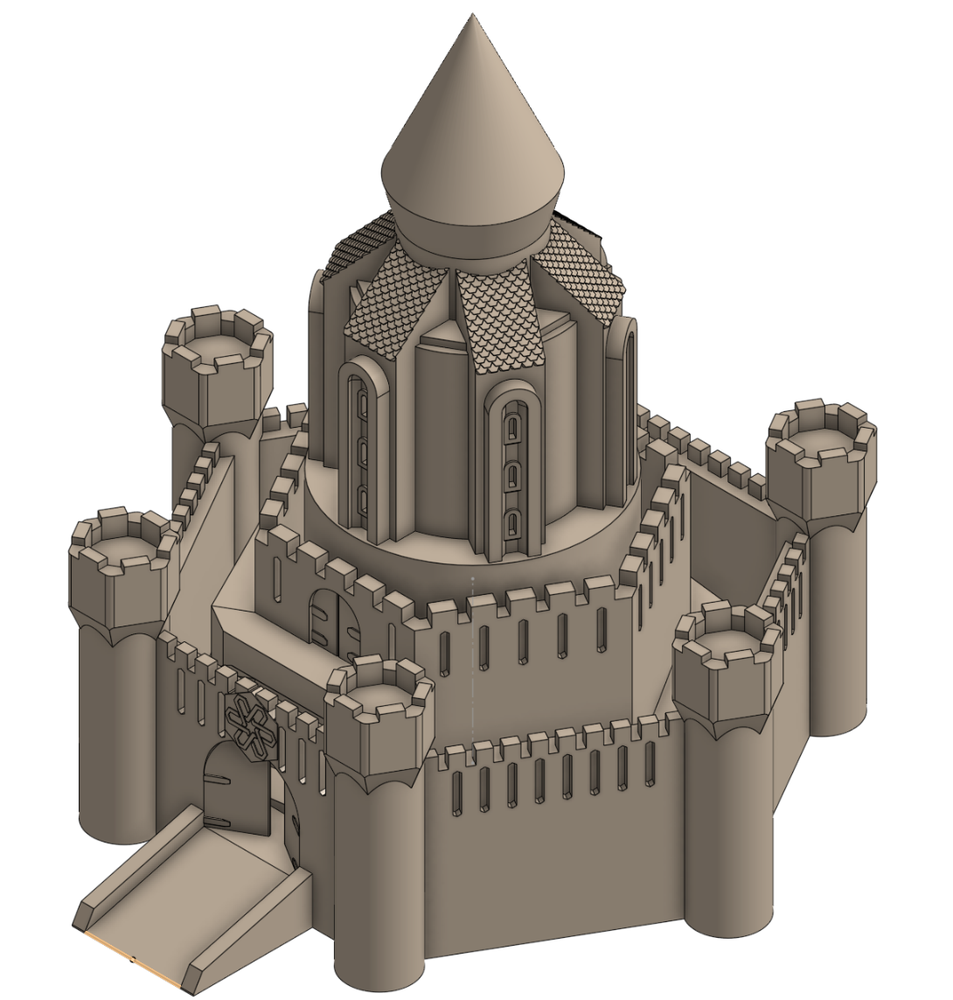
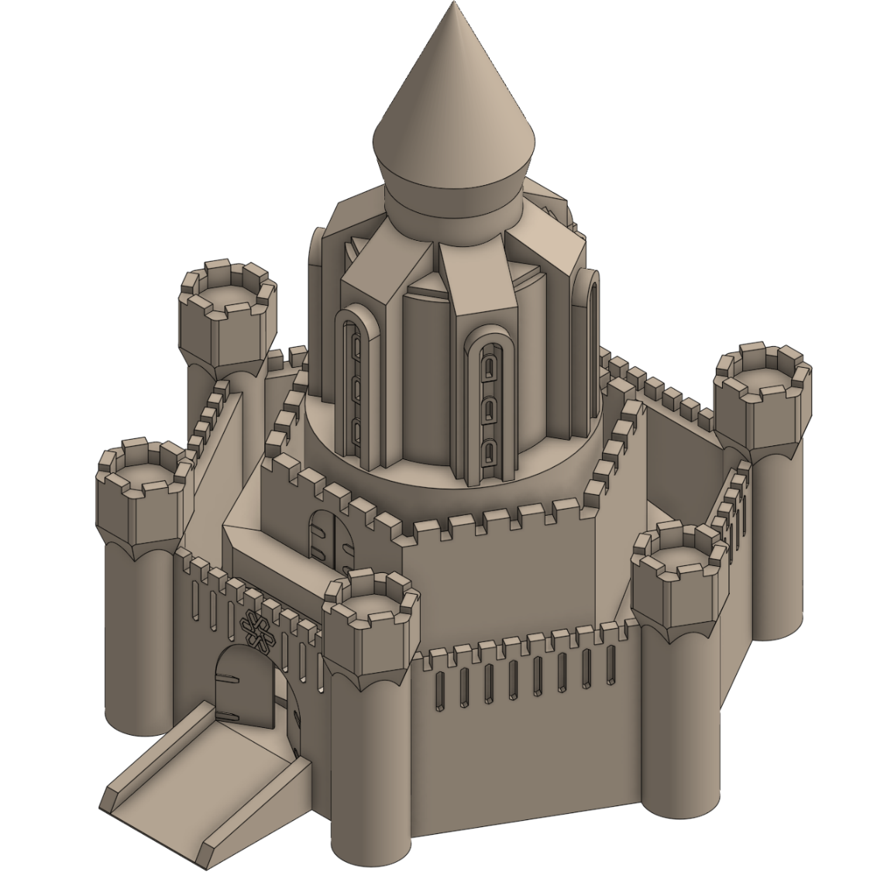
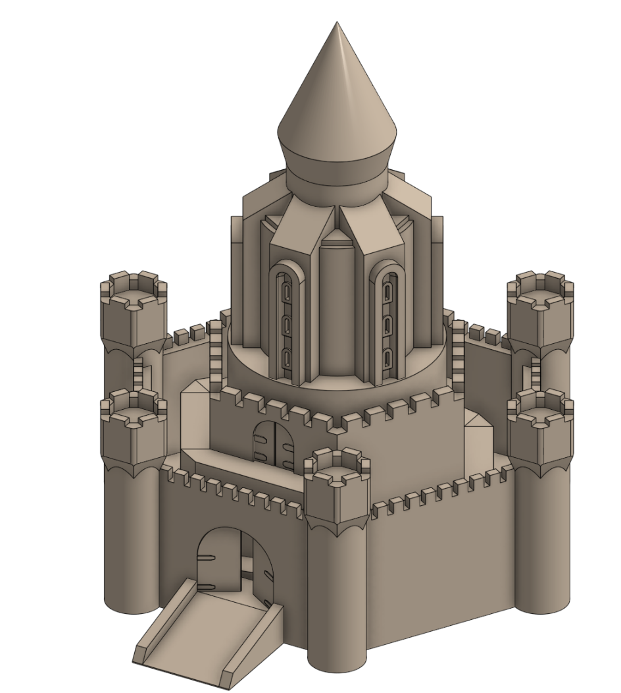
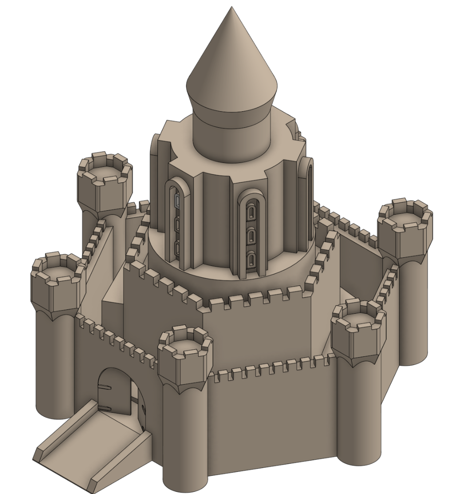
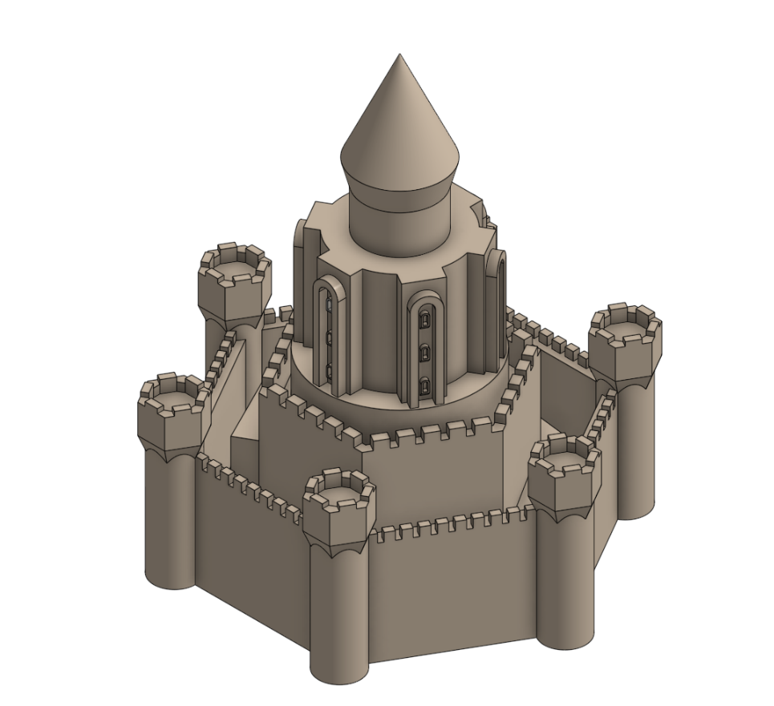
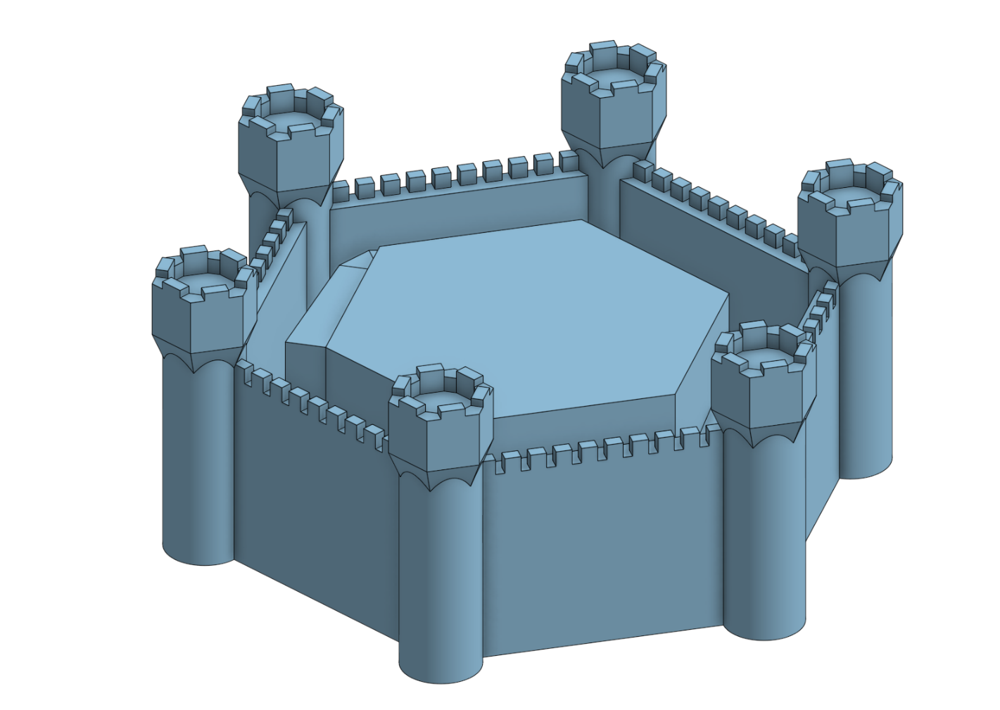

# Journal

## 1/13/26 - 53

I had a bunch of time to work without being able journal, so I got quite a bit done. I started by upgrading the logo over the gate to be inside a larger hexagon. It not any allows me to make the symbol bigger, but also the hexagon just looks cool. I did have the problem that I had to redo some sketches as extruding the hexagon broke them. I don't know why. I then added arrow slits to the inner wall, which wasn't too hard. The final and longest task I did was add shingles to the six angled roofs. I was originally going to do curved (terracotta-like) shingles, but during some research I saw hexagonal shingles and knew that was the right choice. After a few sketches, I used a linear pattern to finish the roof, then copied and used a circular pattern on it to copy the roof tiles to all sides.

## 1/12/26 - 44

I decorated the outer walls of the castle in this session. There were two major decorations, the first was arrow slits. I tried multiple different designs of arrow slits, straight rectangles, crosspieces, crosspieces with hexagons, and ended up with a more minimalist rectangle with pointed ends. The minimalist look fits that castle better, and I realised that they are actually hexagons (just irregular ones). I then wanted to put some detail above the main gate, as the arrow slits were to big to fit, and so did some (un-time-tracked) research into hexagon symbols, and found some I liked to inspire my design on the castle. I had some problems making the breaks in each of the connectors where I couldn't add the breaks in the design without dragging the line very close to my 1mm break, as it would say the sketch could not be solved. I then made it bigger until it could be sliced properly (although it might have to get bigger still).

## 1/12/26 - 35

I did a little more work on the outside details of the castle, making three big changes. I started by doing about three minutes of trying to add shingles and bricks, but I didn't like how they turned out, and so am leaving them for the time being. Instead, I finished off the ramp up to the upper level of the castle by adding a floating section. It had chamfers underneath to make it printable without supports (might be changed after I slice it). I added another gate at the top of the ramp, and I like how it looks with the main, large gate at the base at the smaller gate above. I then tried to add a hexagram to the surface below the central cone, but decided a normal hexagon was better. The outer six pieces then got some sloped roofs.

## 1/11/26 - 25

I started this session planning to do a bunch of decorations on the external wall. I began by thickening the edge of the frame for the arched windows, as after slicing I found that they were not being printed. I then went to add a main gate, and then realised that I had forgotten that the castle was sitting on a fairly thick base. I then spent some time trying to make a bridge extend out, but decided that a ramp would be easier, and more printable. The gateway has an arched entrance (I like arches; I think they look good), but it is quite large, so I added two doors sitting slightly ajar that may be able to help it be printed

## 1/11/26 - 31

I started adding the upper layers of the castle. I am going for a sort of layered cake design, with multiple layers going up. there a number of overhangs with 45 degree chamfers so they hopefully wont need supports (I sliced the towers and they didn't need any), although the arches might have to be removed. I am trying to continue with the hexagonal design, even on the circular towers, by having the outside decorations be in six directions.

## 1/11/26 - 35

I started on the castle part of the model (the shell will be made to fit around it). Before starting, I looked over a bunch of castles before starting, and saw a bunch of hexagonal castles, so I decided to make my castle hexagonal. I did the outer wall and towers first, which was not my best decision as it made doing the inner ramps more difficult. The tops of the towers are an unrealistic (for sand) larger shape on the top, and I am hoping that the draft angle picked will allow them to not need supports to be printed. I may have to change the angle later.

