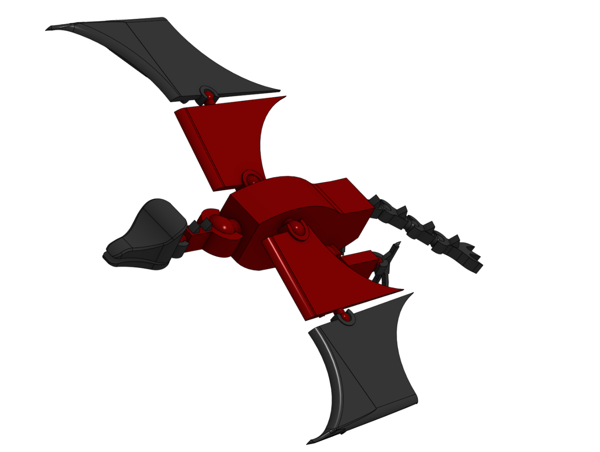
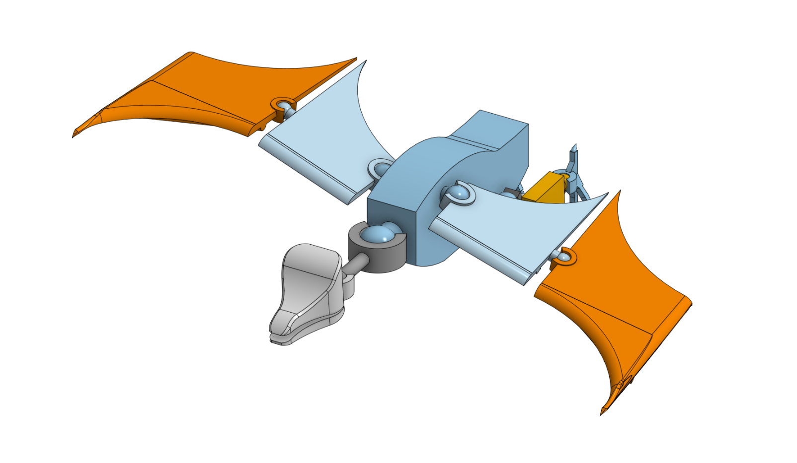
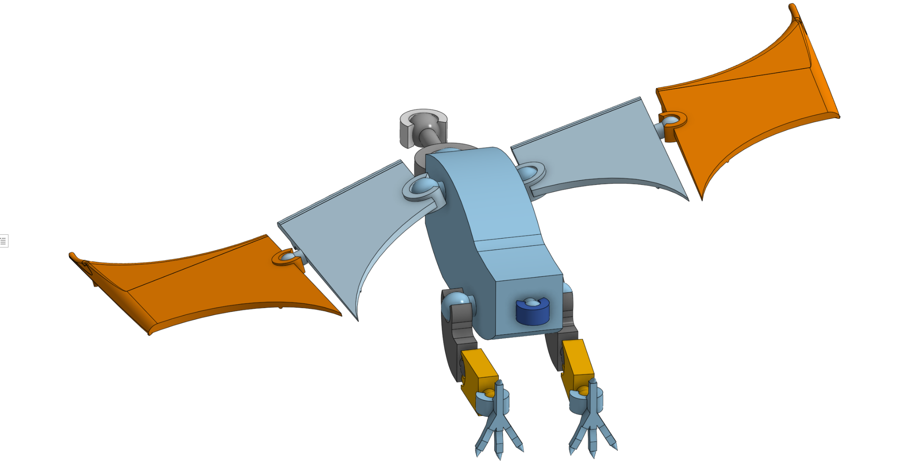
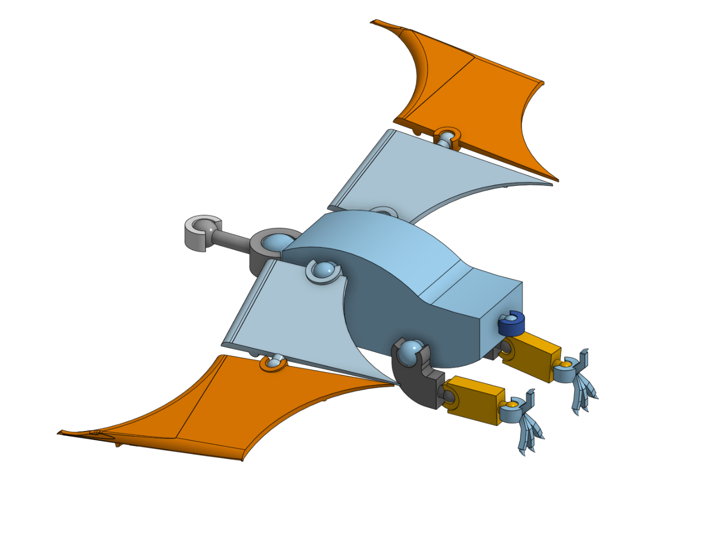
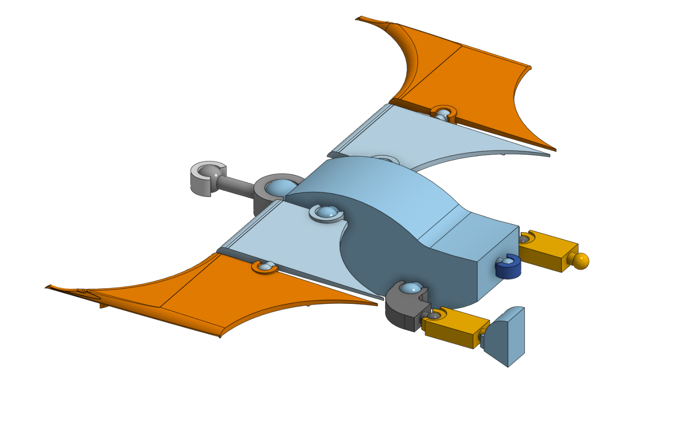
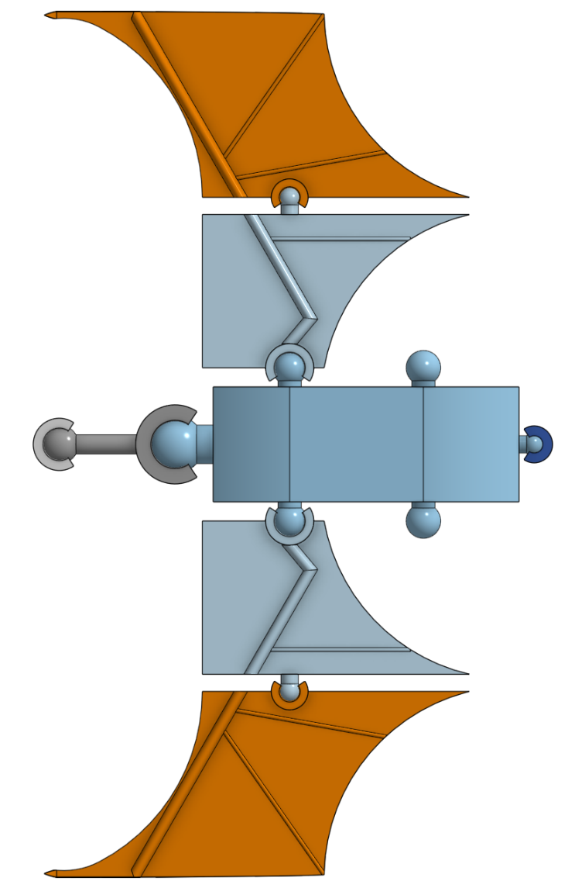
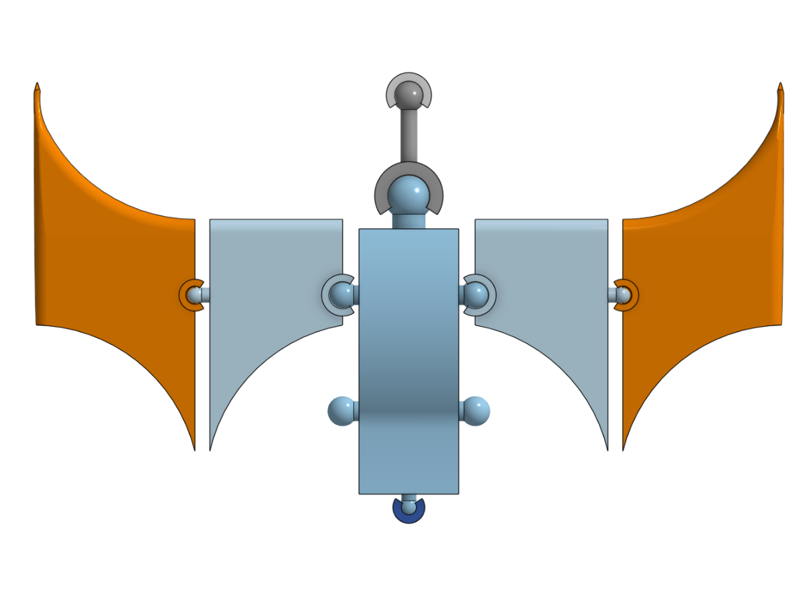
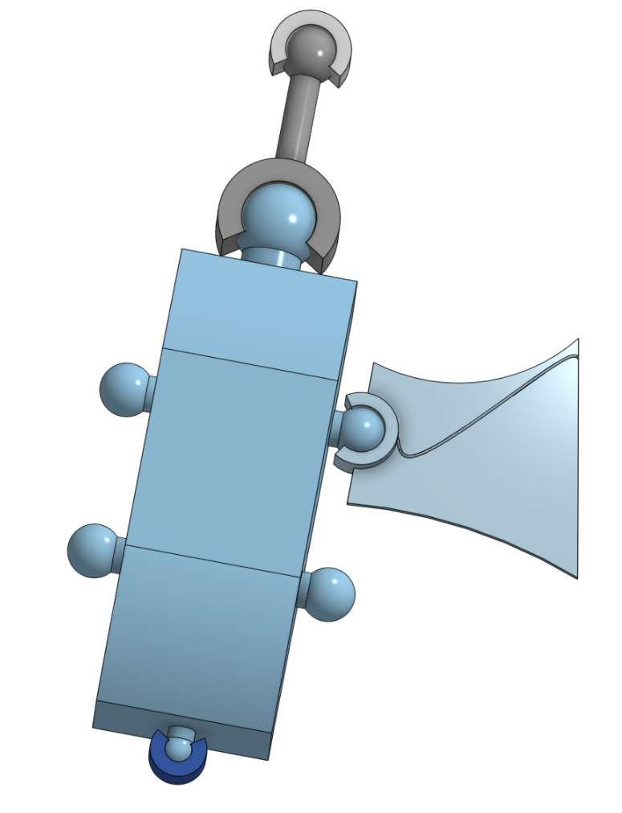
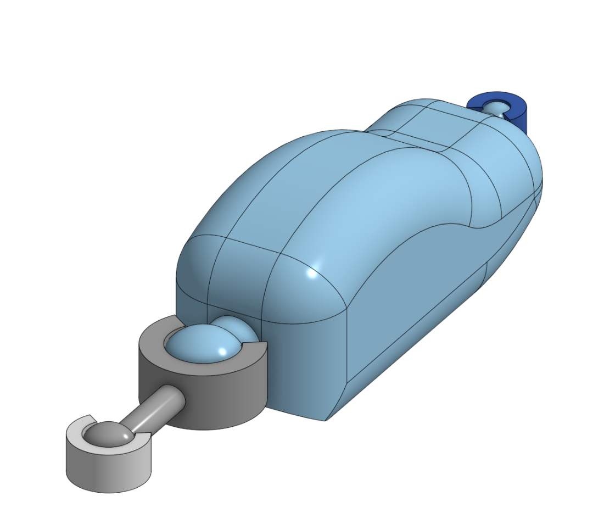

# Journal

# 1/26/26 - 32

The dragon now has a tail! This really helps with the dragon look; it no longer looks like a pterodactyl. The tail is made up of four segments, each a bit different. tithe first is the widest, the second is angled smaller, the third is straight continuing the angled piece, and the final section is the tip of the tail, which has a trident of point on it. Each tail segment also has a spike on the top, and I added some spikes to the neck piece. The reason I worked on this before fixing problem areas such as the head or legs is so I can get a clearer picture of the entire model to fit other parts around. I haven't worked on parts requiring ball  joints in a while, and so made a number of measurement mistakes, and had to look at other ball joints to check how I did them. Before submitting, I did some untracked colouring of the dragon with a red and grey colour scheme. A side not is that all boney parts such as the bones under the wings or spines on neck are grey although the main part is red. Also, my assembly is at an angle so it looks  like the dragon is turning.

# 1/24/26 - 30

I started working on the Dragon's head. I know that organic shapes are hard with cad, but I am struggling a lot with this. The rubber ducky was so much easier compared to a dragon. I attempted to sketch out the basic shape of a dragon with its mouth open, but while I got it to be fairly rounded, it still looks awkward and strange. I think I possibly need it to be linger and flatter, but I accidentally made it too big originally so it got smaller and taller. I think it looks a little bit more like a pterodactyl than a dragon, especially without the tail.

# 1/23/26 - 44

I finally finished the feet... for now. I finally managed to fir a piece between the toes so the feet has a proper flat bottom to print on. I spent a lot of time trying different combinations of extrudes and thickens to get my piece to fit the shape of the foot cleanly. I would explain more, but if I am being honest, this was mostly trial and error. I really wasn't sure the best way to do this, so I just tried fills, lofts, thickens, extrudes, and anything else I could think of to fix the big gap in the foot.

# 1/22/26 - 30

I spent some more time trying to shape the feet. I went with three toes in the front and a smaller tow in the back, and used the same claw trick with lofts as I did for the claws on the wings. I think that the feet look much better, but am concerned about printability. I spent some time trying to bridge the front and back toes with a piece to help it be printed, but so far I have had no luck getting them bridged. I have a number of surfaces existing, but attaching them all into one piece is difficult as there are problems with thickening the surfaces as the fill tool created some really weird shapes to bridge the gaps. Also, I am pretty sure it doesn't count for time, but I spent about 5 minute creating an assembly so I can pose my models to upload here, and I think it looks much better than uploading a .3mf of the part studio.

# 1/21/26 - 25

I started adding the legs. I am noticing that I am getting much faster at creating ball joints (I just hope they work). I made the legs a two part leg including the foot, similar to a human leg. I was having trouble picking what the right leg length was, I still am not sure they are the right length compared to the wings. The wings are the focus, but the legs still need to not be tiny. I also started trying to figure out the right foot shape. I am mostly used to 𝐿𝐸𝐺𝑂® dragons but they look blocky on the more detailed and rounded dragon I have, so I might try to sculpt a 3-toed foot later.

# 1/21/26 - 18

A pretty short journal as I am finishing up the wings for the time being and moving and I like keeping my progress updates fairly focused on what I modified. This time I readded the bone structures to the undersides of the wings. They are once again based off bat wings with the shape of the bones having one major bone and some minor bones holding the wing in place. I created a sketch with just lines mapping out where I wanted bones, and then swept some half circles to create eh bone structures themselves. in order to do this, I learned that curve point planes can crate a plane perpendicular to a line.

# 1/20/26 - 35

I finished the basic models for the wings. There are now two parts connected by a ball joint, and the wings additionally are much larger. After creating the basic shape, I added a claw to the second part of the wing by creating a ellipse and lofting to a point below the wing. I then went to add some shaping, as the flat wing made the larger ball joint connectors look funny. The first section without too many irregular curves worked fine to have a steep slope at the front and then shallowly slope at the back, but on the second section I had to do a number of thickens and extrudes to remove weird artifacts round the claw

# 1/16/26 - 25

I added the joints for the legs and wings, and started the left wing. I removed the fillets on the body, as they made it hard to position the joints. I am not entirely sure how big to make each joint; I did some research before hand, but as I cannot print and test the joints, I am a bit nervous if they will work first try. The wing itself I had some difficulty shaping, so I used bat wings as reference. I plan to make the wings in two sections so they can fold up, with bone details on the bottom of them.

# 1/15/26 - 25

I started creating a dragon by not modeling and watching some videos about ball joints. I can't track it and the first one I made (based on the tutorial) or course, but It will make this dragon a much more interesting and posable model. I then made and shaped the body,  made the two neck pieces, and started the tail piece. My plan for this model is to have the dragon on a rotatable stand so that it can be posed without worrying about it supporting itself.

