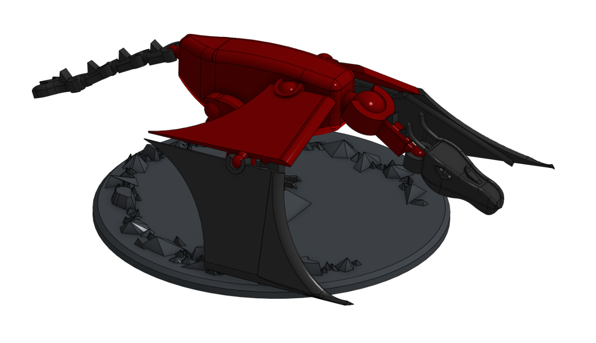
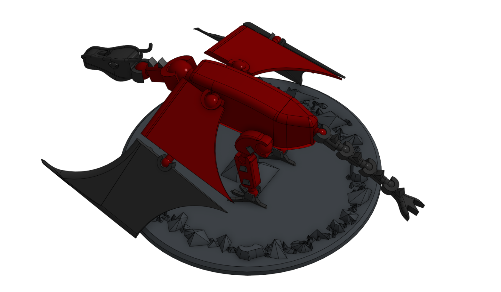

# Dragon

Flying, fire-breathing lizard. This model has 19 parts (note there is only one model for the feet) that snap together with ball joints. The joints have an interference fit so they hold their pose when the dragon is posed. There also are quite a few supports required, unfortunately,

Printables: https://www.printables.com/model/1577895-poseable-dragon

## License
Shield: [![CC BY-SA 4.0][cc-by-sa-shield]][cc-by-sa]

This work is licensed under a
[Creative Commons Attribution-ShareAlike 4.0 International License][cc-by-sa].

[![CC BY-SA 4.0][cc-by-sa-image]][cc-by-sa]

[cc-by-sa]: http://creativecommons.org/licenses/by-sa/4.0/
[cc-by-sa-image]: https://licensebuttons.net/l/by-sa/4.0/88x31.png
[cc-by-sa-shield]: https://img.shields.io/badge/License-CC%20BY--SA%204.0-lightgrey.svg

