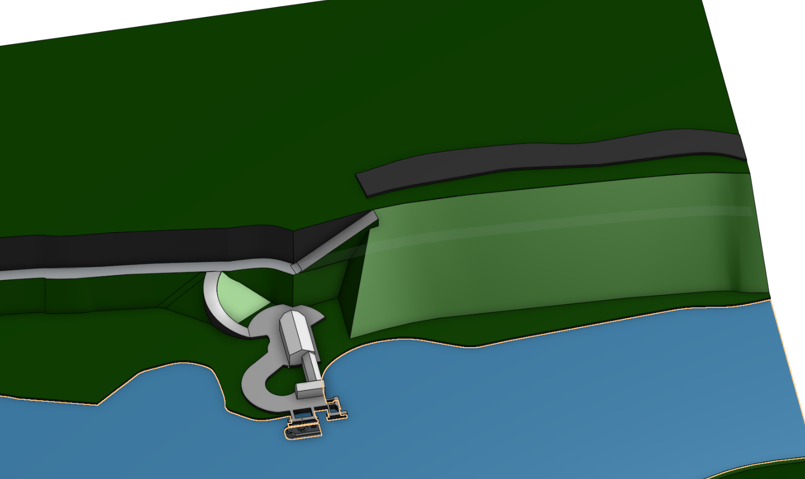
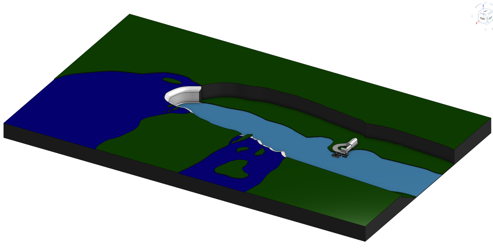
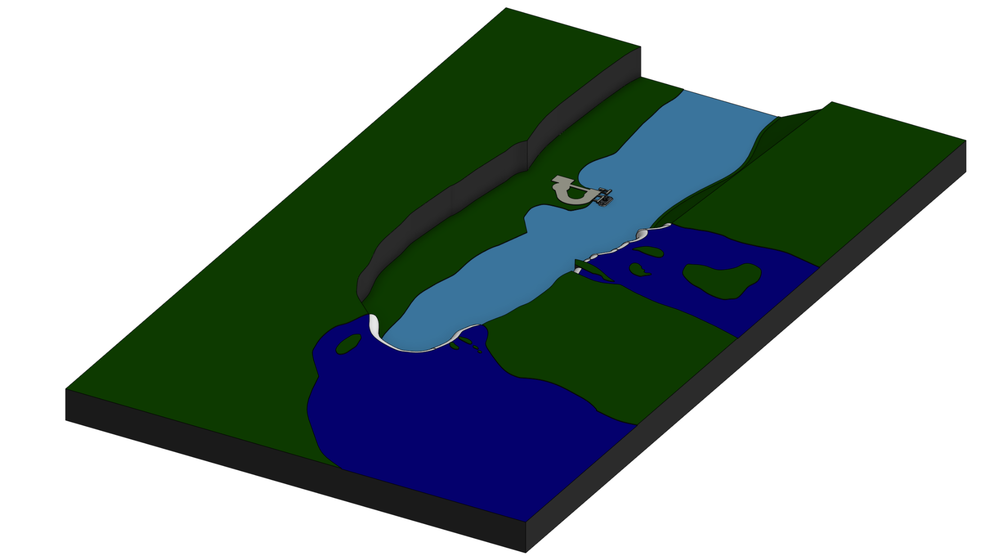
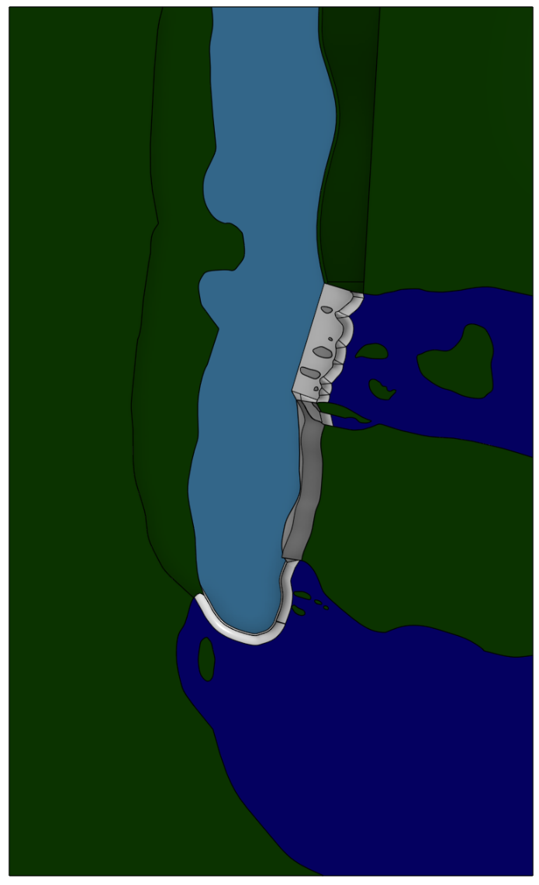
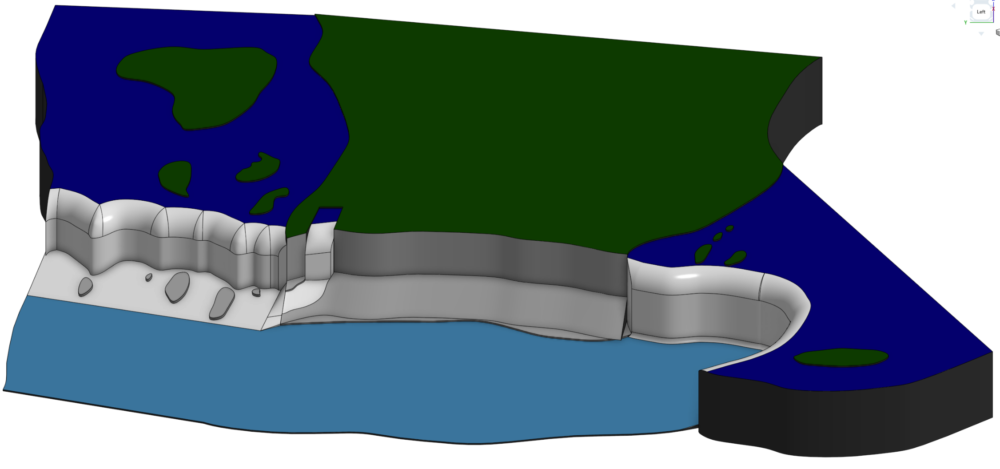
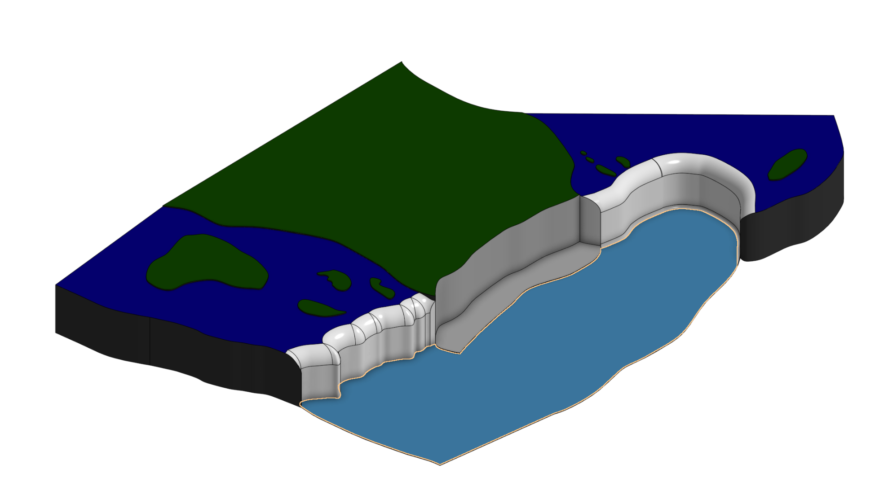

# Journal

## 2/5/26 - 35

I added more to the plaza by the docking station. I may have made the tent like structure a bit too large, but as that is the area where you get ready to board the boat, I think hat that is fine; it is an important part of the process. After adding more tot he plaza, I shaped the hill side behind it using a sweep. It has a road on the top that leads most of the way to the falls. There is a path from the top down to the docking plaza; I used a curved piece and a helix to sweep a ramp up to the top. I had to use trial and error to find the starting angle and number of revolutions that made the helix fragment the right size for the sweep. the ramp is supposed to be surrounded by the hill, so I used some planes to wrap pieces around it. To finish up, I started the road along the top and the ramp for the other road to get to the top. I have found that I have been very scattered in what I work on as I try to figure out how to translate google maps into a real model.

## 2/4/26 - 20

I realised that I had accidentally made the model over a meter long. Maybe my relaxed just-sketch-it strategy was a bad idea. After some trial and error, I ended up shrinking the model to 10% of the original size (this is kind of hard to see one the screenshot and 3d model due to zooming). I was surprised to see that the details in the model still mostly came out. I had to extrude the higher sections up 0.1mm to make them printable, but mostly everything came out. The only thing that was lost was most of the boat; the shape still shows up, but some of the poles and details do not. I then fixed up the dock section, as it broke a bit, and added the tent like structure you head to before boarding the boat.

## 1/21/26 - 23

I started on the docks for the tour boat on the Canadian side of the falls. I once again used google maps as reference, and sketched out approximately how the infrastructure for the docks is set up. I didn't add any of the buildings yet, however. I focused on the boat instead. I sketched out the shape of the boat using the "street view" images on google maps to see the sides better. I may actually have to make this bigger if I shrink the model down, but for now the scale is pretty good. I had problems with the model being too big, so I couldn't detail the ship. i had to use a section view to see underneath.

## 1/21/26 - 31

I have finished the outline for the rest f the falls. There are more landscaping details to do, but overall the basic terrain is done. I connected the smaller falls to the American falls, and extended the river by the Canadian falls, extended the river and high ground, and adjusted some of the island shapes. I am planning to stop the model around where the boat tour docks are so I can include the boats in the model. Also, the model now fits into a rectangle.

## 1/21/26 - 21

I added more details to the American falls today. The American falls have a less steep sloped area under the main falls, so I used a side on image as reference for where to place the rocks sticking out of the water. There is a small waterfall off to the side of the main American falls, so I added that as well. This included adding the sloped ground that exists between the Canadian and American and falls, then lofting the previous water area up to meet it to create the area of runoff. It does look a little funny as this section of water just stop in the ground, but that area is forested, so it was hidden in my image, so I will fix it later when I do the decoration at the top.

## 1/20/26 - 29

To start I created the two main waterfalls— The Canadian and US falls. As reference I used Google Maps with the terrain view. I didn't want to mess with trying to trace an image, I learned that it is a pain for my Middle Earth map project, so this is not to scale at all. I am just looking at the map and making approximately what it looks like using splines. This is much more relaxed and there is much less lag. I had two major challenges in this session. The first was figuring out which way was which when I had the model upside down. I carved an L and R into the underside to help me remember (I should probably remember to remove these when it is done). My second challenge is that Onshape and Google Maps use different controls for panning. I constantly would switch tabs and immediately use the wrong controls.

