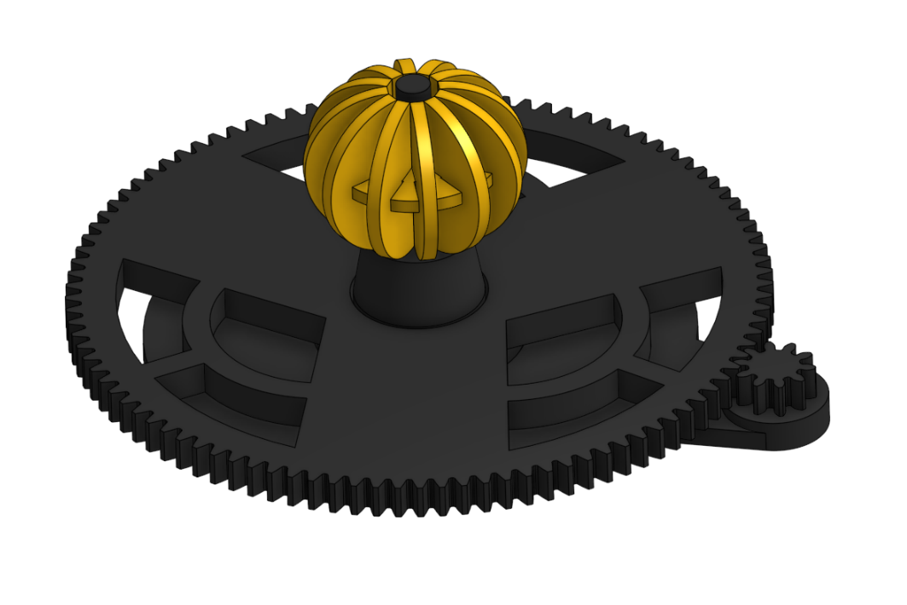

# Journal

## 2/2/26 - 32

For this first session, I got the base sections together. I did some research before actually modeling, and a 0.100 gear ratio with 36.5 days per turn of the handle gives a decent gear ratio of 10:100. i wanted to do a 1:365.25, but it seemed that would involve complicated gearing, and I can't print this myself. This will be a semi complicated model, but one of my goals for this model is to make it a simple for the person printing as possible, as well as having no supports if possible. After that groundwork, I started modeling and made the 100 and 10 tooth gears using the Spur gear tool (I want these gears to actually e functional), and spaced them with an extra 0.5mm to make sure they fit. I sued 0.5mm as the tolerance for the clearance fits, and 0.2mm for parts that need to stick together, as I have used 0.2mm in the past with success. I took chunks out of the 100 tooth spur gear to reduce filament (I couldn't resist keeping some decorative pieces in), and made the stand to hold the 100 and 10 tooth spur gears in place. I had one final piece of groundwork I wanted to do; I started making the sun. I am trying a strategy of having a horizontal holder piece and some vertical curved pieces to create a no support sphere shape, and wanted to test how it looks. It looks like an Orange, I may fix the squished shape later. This journal has been quite long, as I made a variety of groundwork pieces. A quick side note: I am going to upload the 3d models of the part studio, but do screenshots of the assembly.

