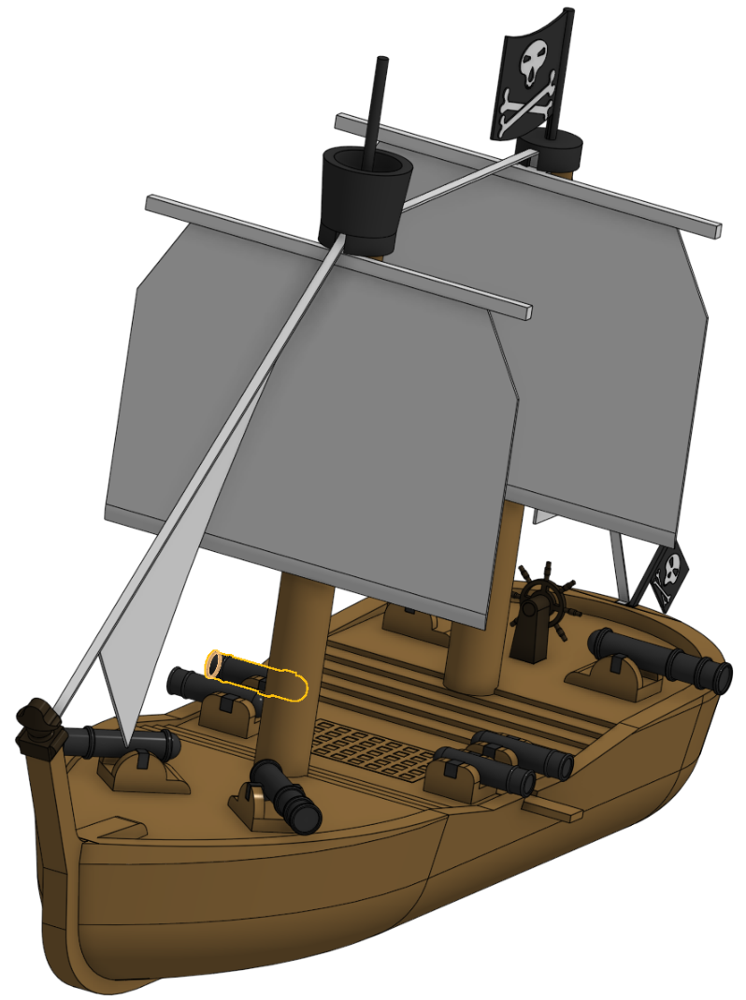
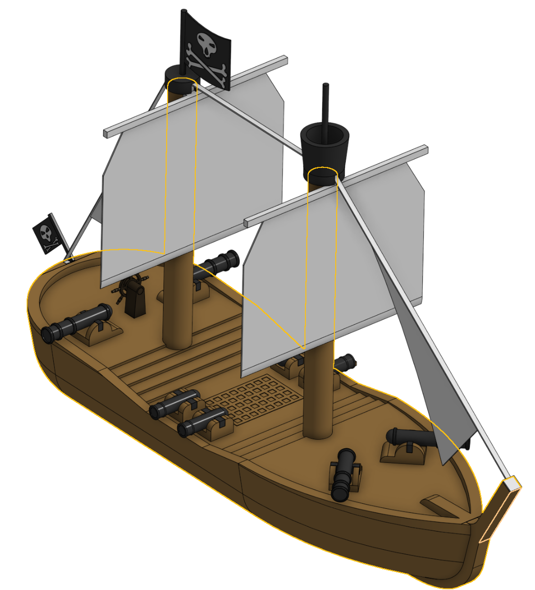
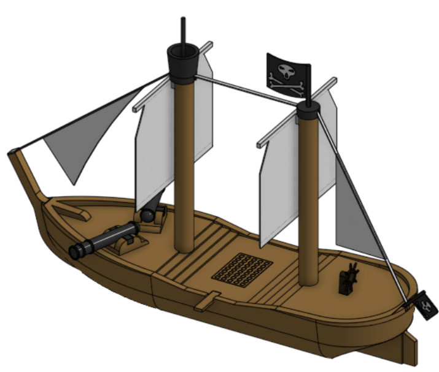
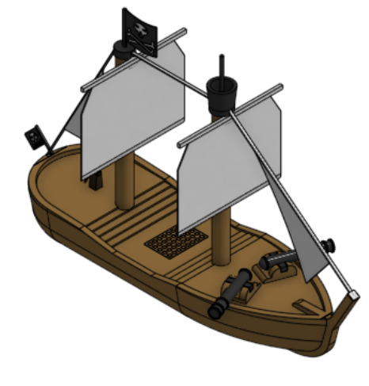
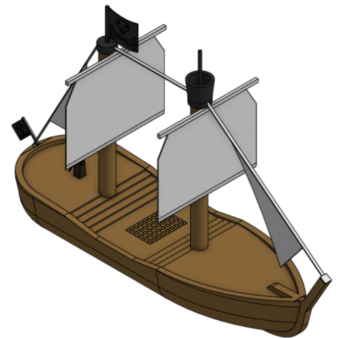
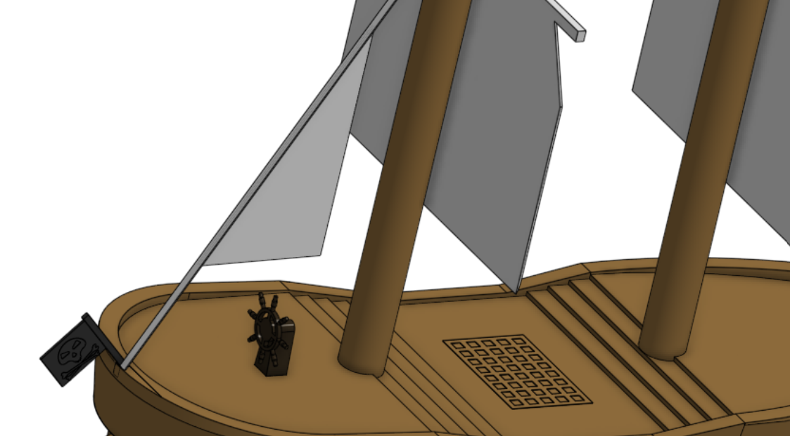
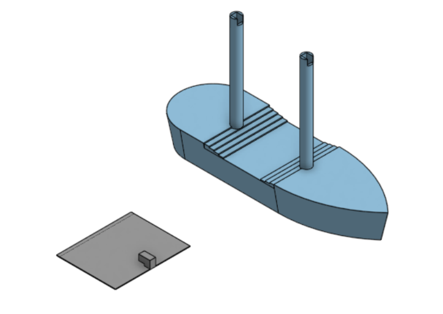

# Journal

## 12/30/25 - 37

To start, I added the 0.1mm tolerances to the mast sail and crows nest. For the main activity in this session, I added a pirate figurehead to the bow post. I had some difficulty with the strange angle the bow post is on, and had to make a number of planes to compensate. Most of my time was spent on the pirate hat. I had difficulty getting it to look "right"; eventually I used a 𝐿𝐸𝐺𝑂® hat as reference (part 2528pb03 to be exact).

## 12/29/25 - 43

I did a lot of work on the cannons. First, I shrunk the bow cannons, as they seemed too large for the scale of the ship, and then I moved them closer to the bow rail. Next, I placed two more of the cannons in the stern, this time pointing directly to port and starboard. Finally, I made 4 smaller cannons amidship facing to port and starboard. These cannons are made with the same technique of a cylinder with decorative rings and a half sphere at the back, but are smaller to fit better. I also shortened the plank so that it is only sticking out halfway to hopefully help it balance better.

## 12/24/25 - 10

I added a plank to the Pirate ship. I first made it attach to a hole under the railing, but after I made it realised that it wouldn't need supports if I used a hole into the deck. The hole has the 0.1 mm tolerances as the other openings. I also added the 0.1 mm tolerance to the ship's wheel.

## 12/24/25 - 41

I added tolerances to the parts that must fit together, and added cannons. I previously had made all the inserted parts a perfect fit, but as this needs to be 3d printable, I increased the slots by 0.1mm. I then added cannons in the bow of the ship. The cannons' bases are part of the ship model, but the cannons themselves are separate parts as they would be huge overhangs if they were attached, and also as I could colour the entire part instead of having to select individual faces

## 12/23/25 - 37

I split the Bowsprit into two parts, with the backstay and back sail in one part and forestay and front sail in another. This will hopefully make printing easier. I also added a crows nest and 2nd skull and crossbones flags, as the masts were looking a little bare.

## 12/22/25 - 26

Thickened the backstay and added a sail on the stern side, as well as adding grating where a hatch to the lower decks could be and the ship's wheel. The wheel is in two parts, the stand and the wheel, as it would take more supports if it was directly attached to the ship. I also added colour to the model.
Also I  renamed the repository from "Sailing Ship" to "Pirate Ship"

## 12/22/25 - 49

Added a flag on the stern with a skull and crossbones on it. Spent most of my time trying to shape the skull and crossbones to fit on the flag and actually look proper. I made it to big the first time and had to try to shrink it to fit on the flag. The flag is slightly off centre to allow the rigging to touch the rail, but it is close enough to not look off.

Also I  renamed the repository from "Sailing Ship" to "Pirate Ship"

## 12/21/25 - 36

Added the bowsprit (front sail) and the forestay and backstay. It is attached by slotting into the bow post and sitting on top of the masts. It is another part where there could be support problems, but the sail attachments make attaching to the masts difficult. I spent some time trying to fit a sail at the back of the ship similar to the bowsprit at the back of the ship, but with only two big sails, it didn't really fit with the rest of the model.

## 12/21/25 - 38

I added the rudder, keel, and bow post to the ship, as well as adding some sloped railing sections and rounding the bottom of the ship. This does unfortunately add overhangs, but i kept the keel very thin and made the railings a solid piece to reduce them as much as possible.

## 12/20/25 - 28

I started making the base for the ship, and the sail. The sail will slot into the mast with a square peg in order to make it easier to print. The ship does have a slant outward in order to make it look more ship-like. The angle is only 10°, so hopefully it will not be a problem.

