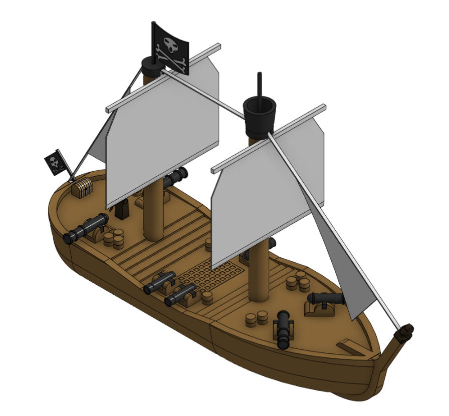
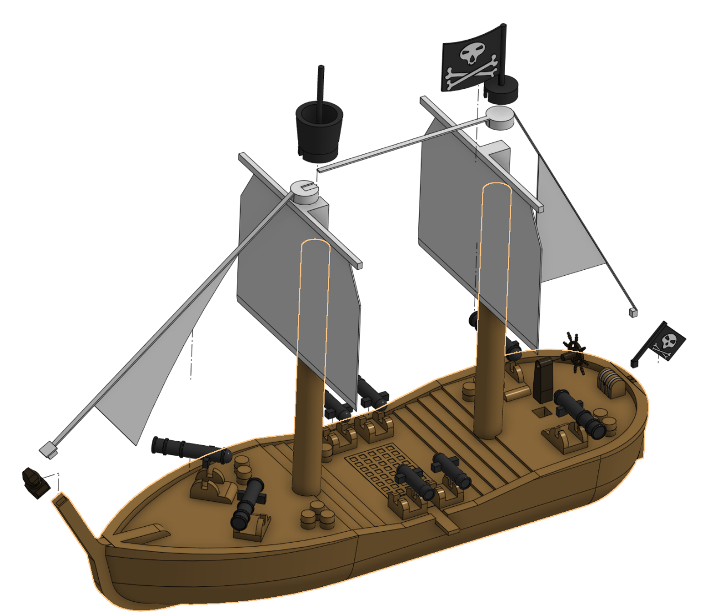
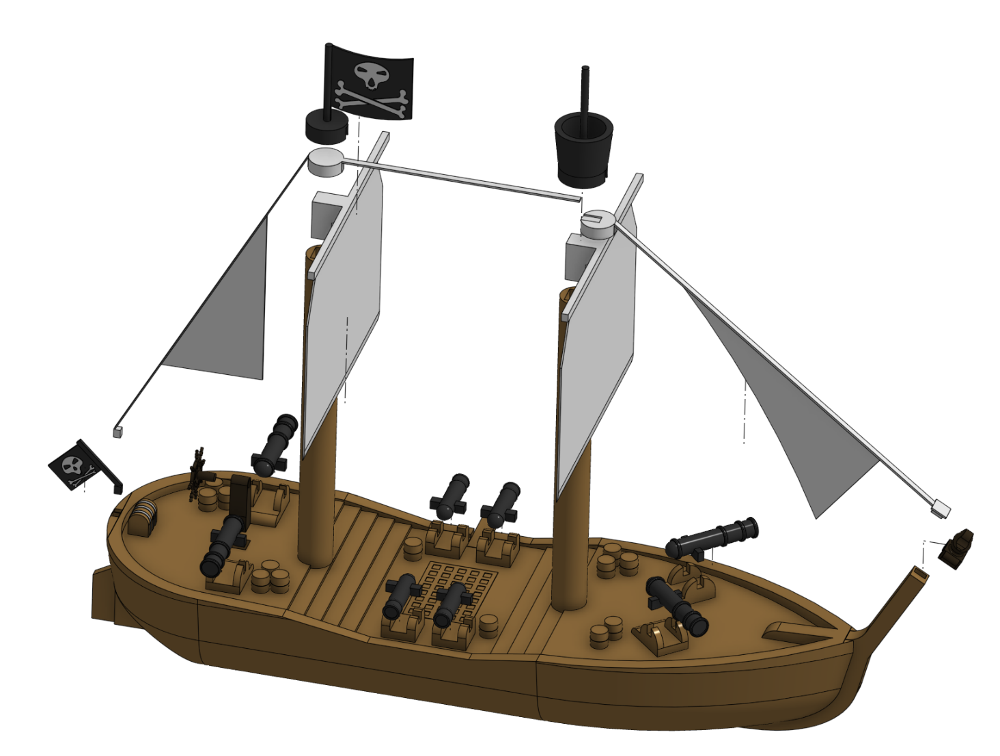

# Pirate Ship

A large pirate vessel.

Printables: https://www.printables.com/model/1536231-pirate-ship

## Parts

Individual part files are the Pat Files folder. All_Files.3mf All_Files.step and All_Files.stl contain the laid out parts, whereas Pirate_Ship.3mf, Pirate_Ship.step and Pirate_Ship.stl contain the assembled ship.

## Exploded Views

Left:

Right:

## License
Shield: [![CC BY 4.0][cc-by-shield]][cc-by]

This work is licensed under a
[Creative Commons Attribution 4.0 International License][cc-by].

[![CC BY 4.0][cc-by-image]][cc-by]

[cc-by]: http://creativecommons.org/licenses/by/4.0/
[cc-by-image]: https://i.creativecommons.org/l/by/4.0/88x31.png
[cc-by-shield]: https://img.shields.io/badge/License-CC%20BY%204.0-lightgrey.svg
