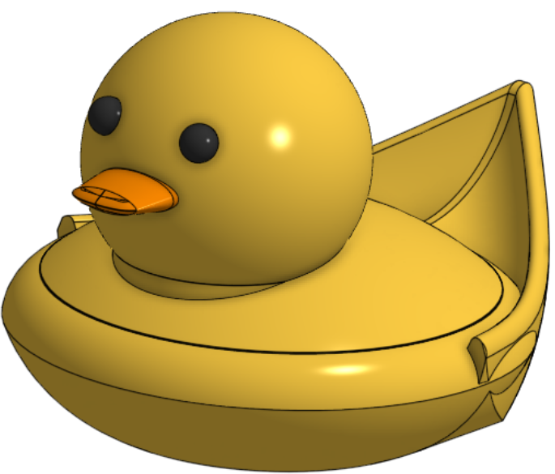
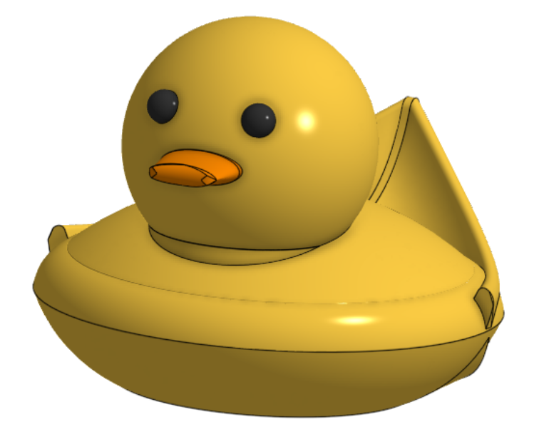
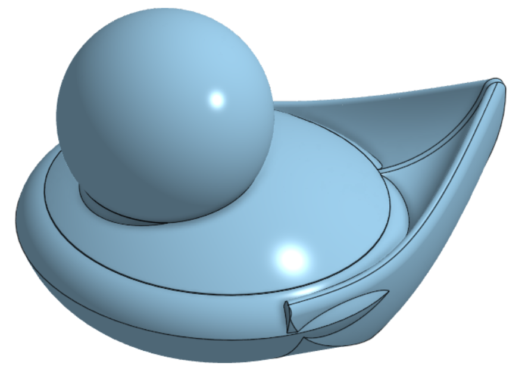
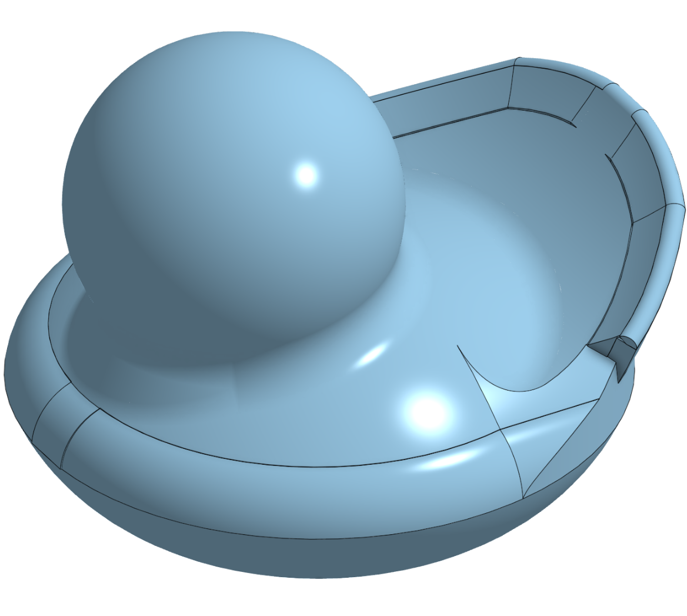

# Journal

## 12/29/25 - 33

It was splines and sweeps to the rescue again. I redid the tip of the beak, as the old one didn't fit very well. I created a spline using the tip of the old beak, removed it, and then swept a section of the main beak to form the new beak. The new beak still has some strange flat sections, but is an improvement over the old one

## 12/29/25 - 28

I started working on the face. I used spheres for the eyes, and used an extruded ellipses with a draft for the beak. I tried to use additional curves to shape the beak, and it worked for the most part, but it still has some strange curves on the side. I tried a bunch of fillets to smooth it out, but they couldn't be large enough.

## 12/28/25 - 38

I completely removed my previous tail design, and started over. It was just too messy to try to use the previous one. The new tail uses a similar 1mm symmetric curved base, but I used a loft on a spline to add the curve, which is much better. It should be much easier to work with.

## 12/28/25 - 36

I started this time by redoing the head to body connection. I creates a really large sphere, moved it down until the top part of the sphere fit with the head, and removed the rest of the sphere. I then attached the sphere to the body with the Boolean tool. Next I tried to work on the tail. There was a weird overhang with how my previous attempt at the tail attached to the body, so I used the loft tool to try to slope the tail section down more smoothly. The connection at the back is better, but the sides are quite rough at the moment.

## 12/27/25 - 30

I started work on the duck's tail. I created a basic shape for the tail and extruded it 5mm symmetrically. Then, I extruded an angle and used the shape of the tail to remove sections, causing a sloped section the fit the tail's shape. After the it was just cutting off areas the were outside the body, and trying to use fillets to smooth out the jagged edges. It still needs some something, but is getting closer to the shape of a real rubber ducky.

## 12/26/25 - 30

I started modeling the body of the duck based on a real rubber duck. I had some difficulty trying to create the shape of the duck, but using some revolves really helped with creating the shape of the body.

