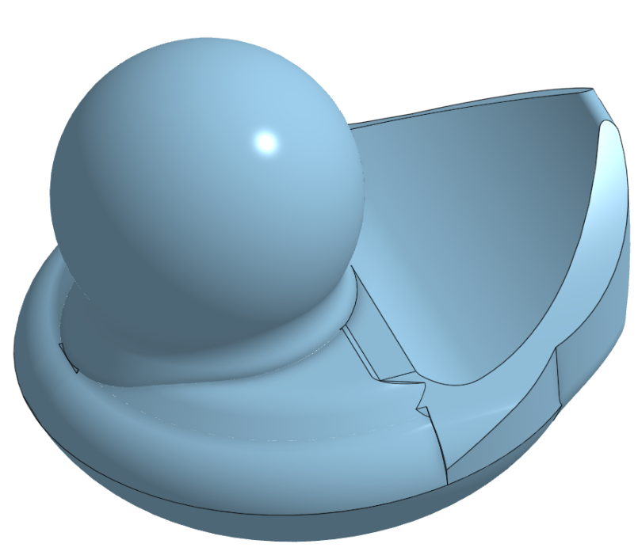
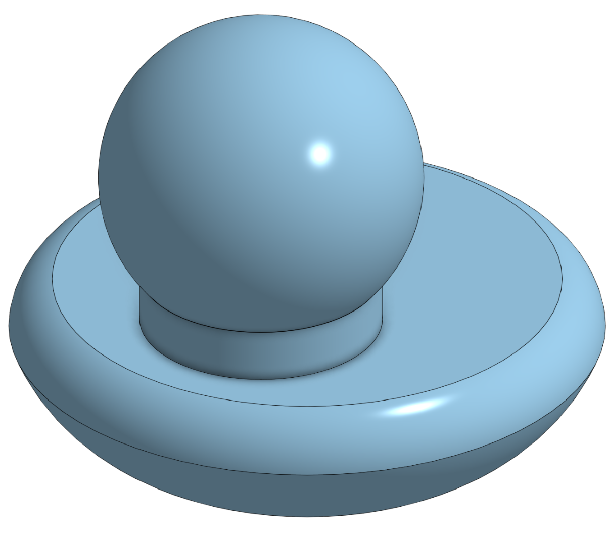

# Journal

## 12/27/25 - 30

I started work on the duck's tail. I created a basic shape for the tail and extruded it 5mm symmetrically. Then, I extruded an angle and used the shape of the tail to remove sections, causing a sloped section the fit the tail's shape. After the it was just cutting off areas the were outside the body, and trying to use fillets to smooth out the jagged edges. It still needs some something, but is getting closer to the shape of a real rubber ducky.

## 12/26/25 - 30

I started modeling the body of the duck based on a real rubber duck. I had some difficulty trying to create the shape of the duck, but using some revolves really helped with creating the shape of the body.

