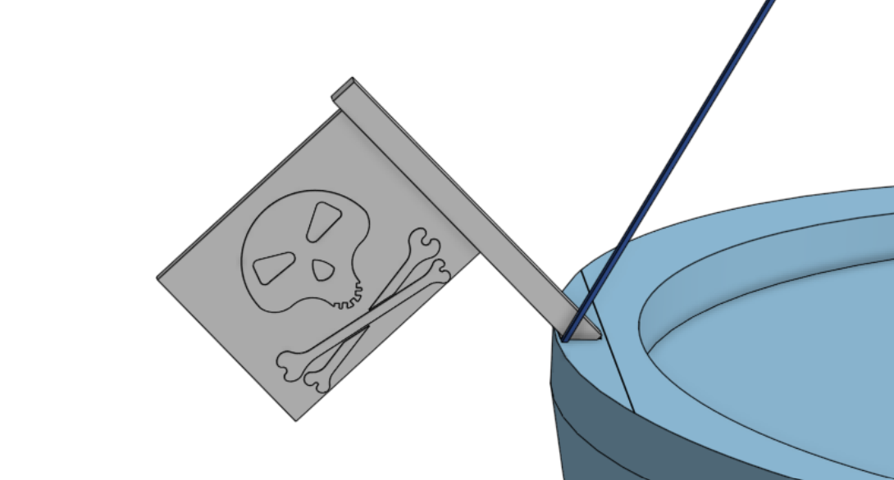
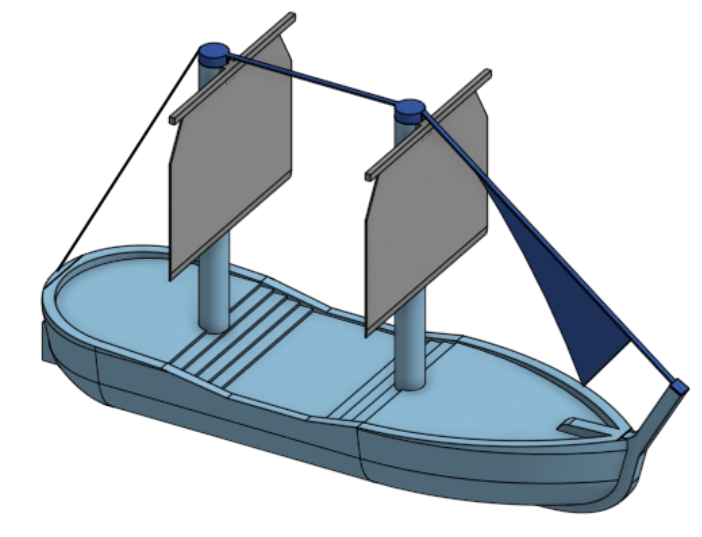
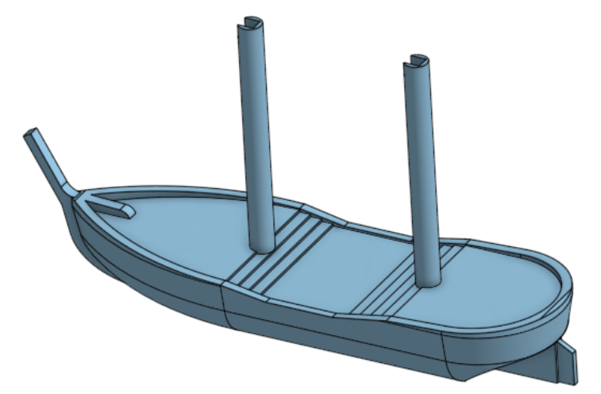

# Journal

## 12/22/25 - 49

Added a flag on the stern with a skull and crossbones on it. Spent most of my time trying to shape the skull and crossbones to fit on the flag and actually look proper. I made it to big the first time and had to try to shrink it to fit on the flag. The flag is slightly off centre to allow the rigging to touch the rail, but it is close enough to not look off.

## 12/21/25 - 36

Added the bowsprit (front sail) and the forestay and backstay. It is attached by slotting into the bow post and sitting on top of the masts. It is another part where there could be support problems, but the sail attachments make attaching to the masts difficult. I spent some time trying to fit a sail at the back of the ship similar to the bowsprit at the back of the ship, but with only two big sails, it didn't really fit with the rest of the model.

## 12/21/25 - 38

I added the rudder, keel, and bow post to the ship, as well as adding some sloped railing sections and rounding the bottom of the ship. This does unfortunately add overhangs, but i kept the keel very thin and made the railings a solid piece to reduce them as much as possible.

## 12/20/25 - 28

I started making the base for the ship, and the sail. The sail will slot into the mast with a square peg in order to make it easier to print. The ship does have a slant outward in order to make it look more ship-like. The angle is only 10°, so hopefully it will not be a problem.

