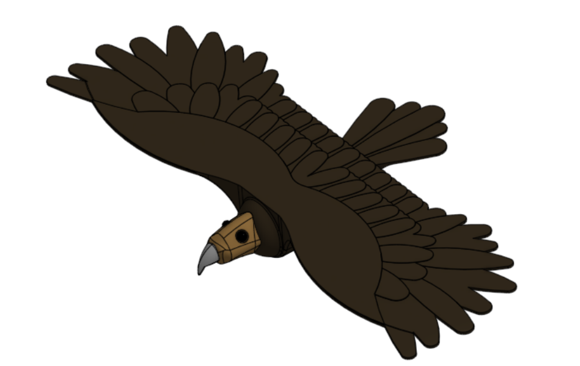
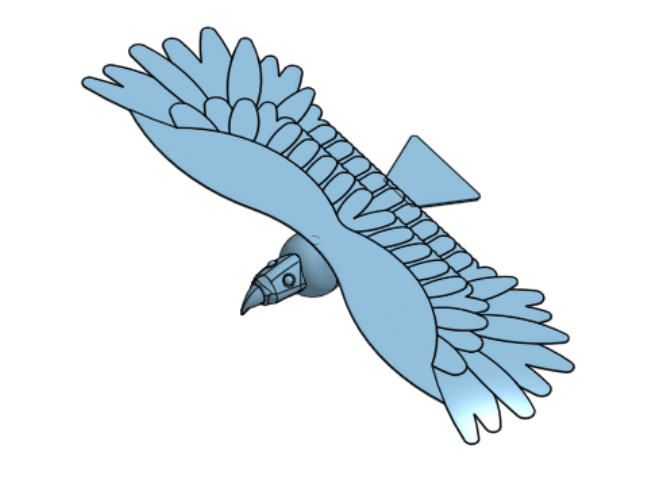
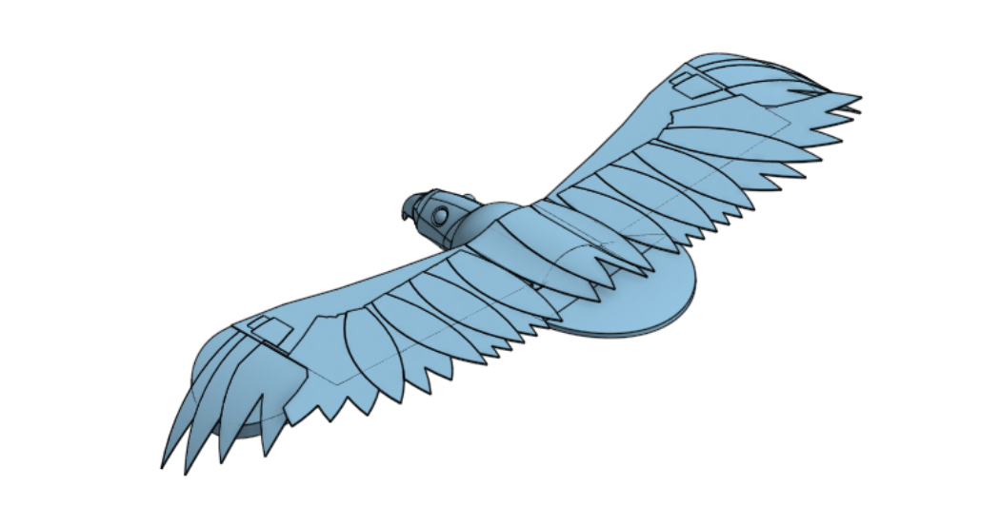
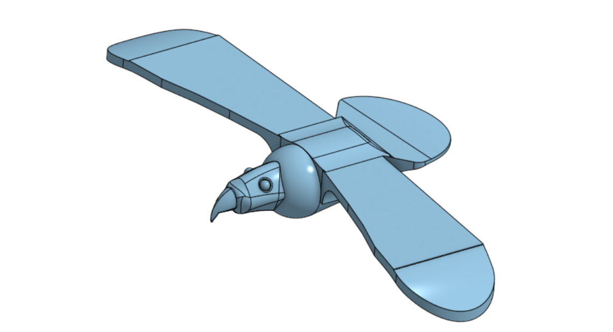
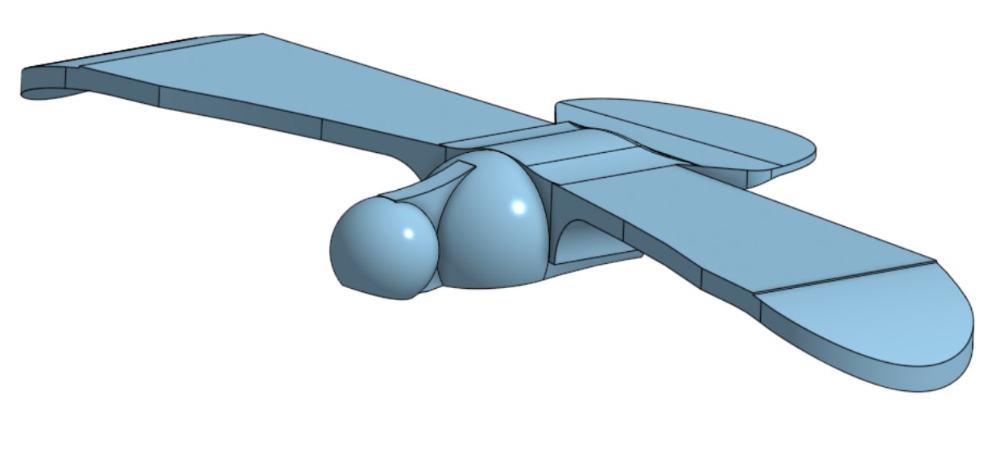
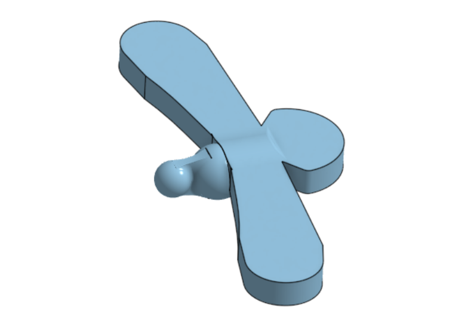
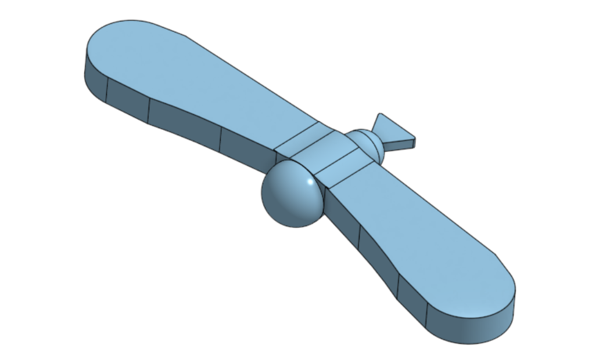

# Journal

## 12/19/25 - 28

I added feathers to the tail, and smoothed out the body to wings transition. I maybe like fillets a bit too much. Also, I added some colour based on the Eastern Imperial Eagle.

## 12/18/25 - 74

I completely redid the wings. They are now thinner and are fully feathered. Unfortunately, I had previously made the tail dependent on the wings, so removing the old wings forced me to remove the tail as well. I attached a quick placeholder so I could see how the wings and tail looked together. I tried to used linear patterns where I could, but all the curved sections I had to feather by hand.

## 12/17/25 - 39

I started trying to feather the wings. I struggled a lot trying to make the feathers fit around the curved ends of the wings, although I eventually got the wrap tool to work it is not perfect. I like the overlapping pattern for the feathers, but the wings might need to be flattened as the curves are just hard to work with. I used an image from https://www.pinterest.com/pin/778137641876483864/ as reference for feathers.

## 12/16/25 - 34

I removed the sphere for the head and attempted to shape a new one. It looks alright, but it will likely need some more work later. I spent an lot of time trying to get the shape right with different curves and fillets, and the shape is not bad, and the beak looks pretty good (although maybe a little to parrot-like?), but it isn't tied into the wings perfectly. Might need to remove the half sphere and shorten the body a bit.

Also I reached the 2-hour mark exactly.

## 12/16/25 - 29

Shaped the wings to have proper curves and be much thinner, and then shaped the tail to be thinner and have a slight curve. I started trying to shape the head and body to fit the wings, but they still need some work. The spherical head might need to be swapped out. At the moment it does look a little like an airplane, but hopefully feathers will fix that in the future.

## 12/15/25 - 18

Updated the tail to be larger and connected to the wings. A base shape for the head and neck has been added as well, although no beak yet.

## 12/15/25 - 39

I started blocking out the basic layout of the body. The wings will be slimmed down and shaped properly later, as will the tail. There were a few problems with a non-manifold body adding the transition from body to wings, as it happened I missed a section when extruding. My reference material for the shape is searching "eagle wings" in Google.

