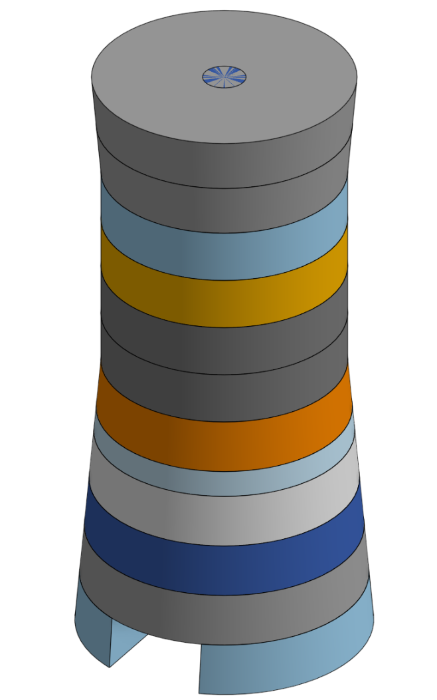

# Journal

1/1/26 - 50

I started creating the dice tower by making a tower of individual rings. This tower is split into sections that slot together, which will hopefully allow it to be printed without any supports. I started adding the stairs for the first few levels; the stairs use a central column for alignment. Each section will also have a number for what level it is to help with assembly, this number will not be seen after the tower is assembled. I spent a lot of time trying to figure out the best shape, angle, and size for the stairs. I currently have the stairs being 38 mm wide, double the width of a normal dice, and they are attached to the corner of the previous step. This will be changed as required during design.

