# Journal

## 1/17/22 - 27

The bricks are done. I finished the bottom two layers that have the archway and exit, and did the inside of the top layer. When I started, I was worried that the archway would cause problems for attaching the bricks. However, when thickening the outside, the archway and inside the archway isn't come with the thicken, allowing me to easily remove that brick sections inside the arch. What did cause me problems was the bottom layer. I had made my cylinder as normal, found the area, and divided by 30 (which is section height) to get the length my rectangle needed to be to wrap around the tower perfectly. I then went and made the bricks, wrapped them... and realised that they overlapped at the back. I tried shrinking the bricks, the gaps between them to no avail. I had forgotten something important, that, when adding the ramp, I had extruded the base by 0.2mm to add rigidity to it. After realising my mistake, a quick recalculation of the area made them all line up top my relief.

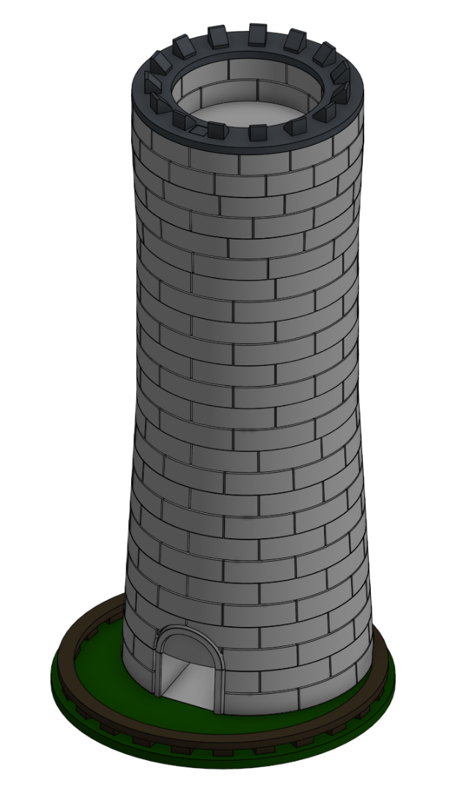

## 1/16/22 - 33

More layers are done! I can tell I am getting faster at doing layers, but the conical sections are still taking me time. Being unable to wrap horizontally on the conical sections is still a bit of a pain. On the plus side, I made the bricks slightly smaller instead of larger this time, and all the lower conical layers are aligning. When I am sketching, I am making the two offset bricks, then using a linear pattern to extend them the length of the section. As I never make them the perfect size, I have the choice to whether choose he one slightly inside, expanding all bricks, or choose the brick outside, shrinking all the bricks. I am not sure why, but choosing the outside brick is making them all line up, which is really, really nice.

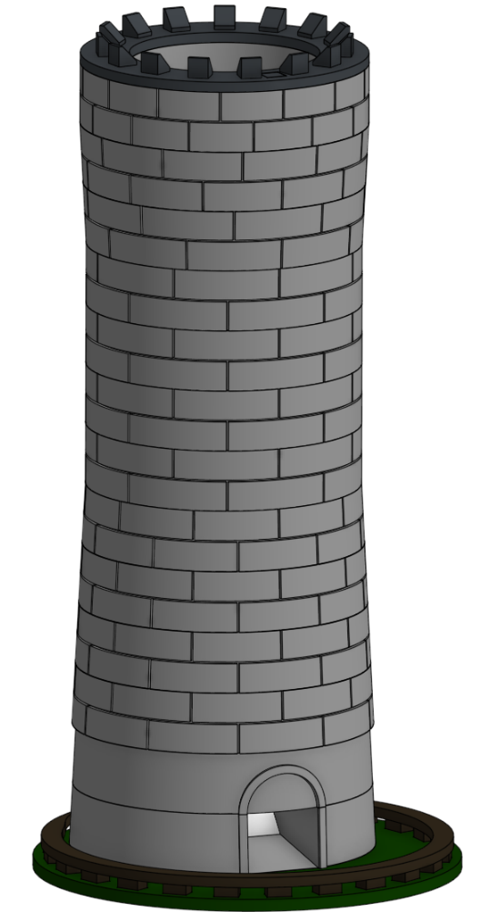

## 1/15/22 - 30

I added even more bricks! I finished the four vertical pieces, which were really nice and easy. I did have the problem that I forgot to add the spacing between the final brick and the edge where it would wrap around, so it merged with the first brick. it took quite a bit of messing with constraints to finally get it fixed. The problem was exacerbated by the fact that I had used a linear pattern to cover all four sections, so I had to find the right constraints in every section of the pattern. I also started on the first conical section of the base, and expanded the crenelations piece to fully cover the bricks (I may put bricks int he inside top section, but don't want to extrude them out). Only five more sections to go!

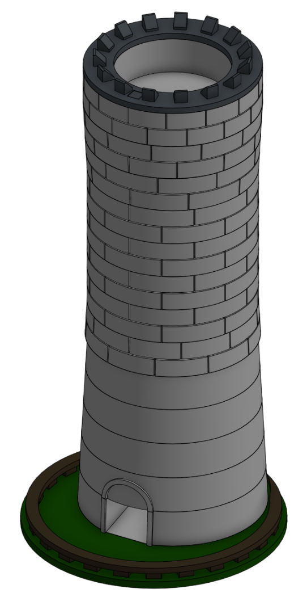

## 1/14/22 - 43

I went to put bricks on the two upper sloped sections, and found out that I couldn't wrap the bricks around the conical sections without it curving off at a weird angle. I tried a number of ideas such as changing an angle in the wrap and making a plane angled next to the section. Eventually i just made another cylinder around the section, wrapped the bricks onto it, then carved them into a conical shape with a thicken. It works, and I think it does look good, but it does have the problem that due to the different sizes of sections the bricks do not perfectly line up. I am glad I didn't have to give up on the bricks, but it would be nice if there was a simpler solution.

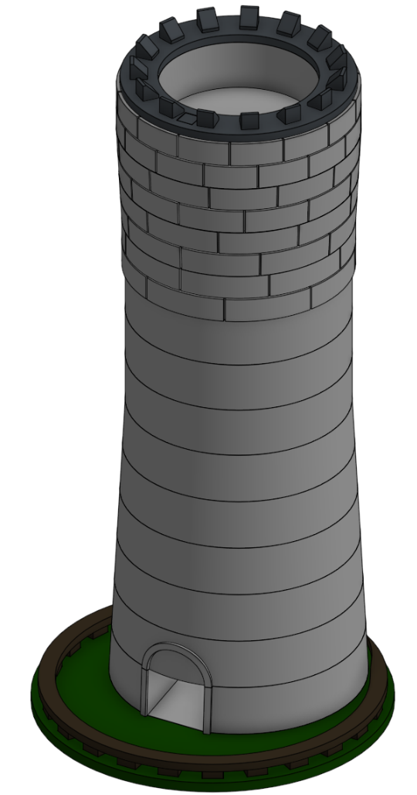

## 1/13/22 - 15

I made quite a bit of progress in a short time. I realised that if I made a rectangle with the same area as each layer, I can ensure that the bricks perfectly wrap around the outside. I only had time for the top layer, but it looks really good and I think once the rest of the layers are done it will look really good.

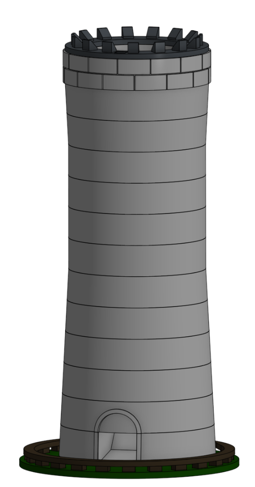

## 1/12/22 - 26

This is a very not visible change. I was listing the things I needed to still do on this project, and I realised that I had added no tolerances to the parts that must slot together. Accordingly, I added a 0.2mm tolerance to every single hole, and shrunk the pegs by the same 0.2mm amount. Just in case I need to change my tolerances, I made the tolerances a variable.

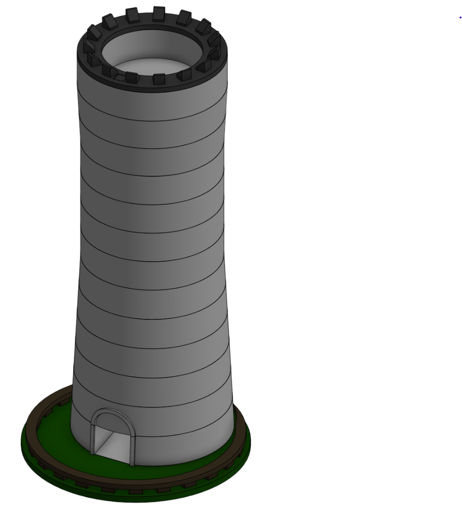

## 1/10/26 - 26

I started on the archway over the dice exit. I started by creating and arch an wrapping it onto the base and stage 1, and then did a lot of adjusting to make it actually fit. The arch extended beyond the edges of the main stages, and had to be trimmed to fit around that and the doorway. I had some problems with the wrap causing them to be curved surfaces and not easy to use flat ones, so it took a number of extrudes and thickens to get the arch to fit properly.

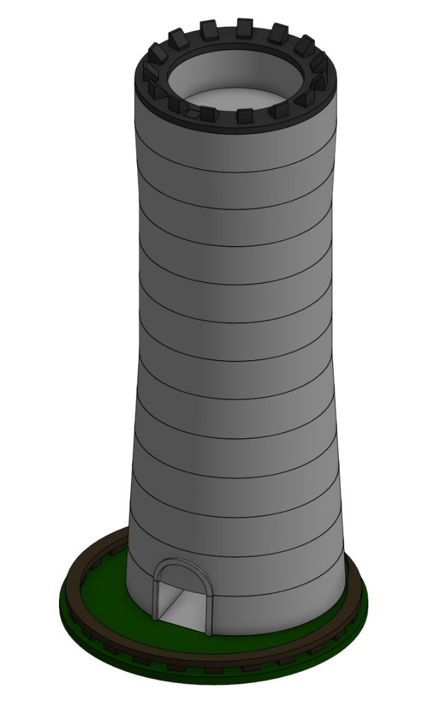

## 1/10/26 - 21

I updated the crenelations to be much more physically possible, as it would have been impossible to assemble them the way I had it originally. To start, I removed the draft angle from the top piece of the tower, and deleted the old crenellations . The new crenellations are split into two parts- a connector peg, and the decorations themselves. Being printed in two parts means that no supports will be necessary. I also made some modifications to the top layer, modifying the opening to be more aesthetically pleasing. It now has a curved edge to match the upper wall, and connects to the curved outer while via two right angled walls.

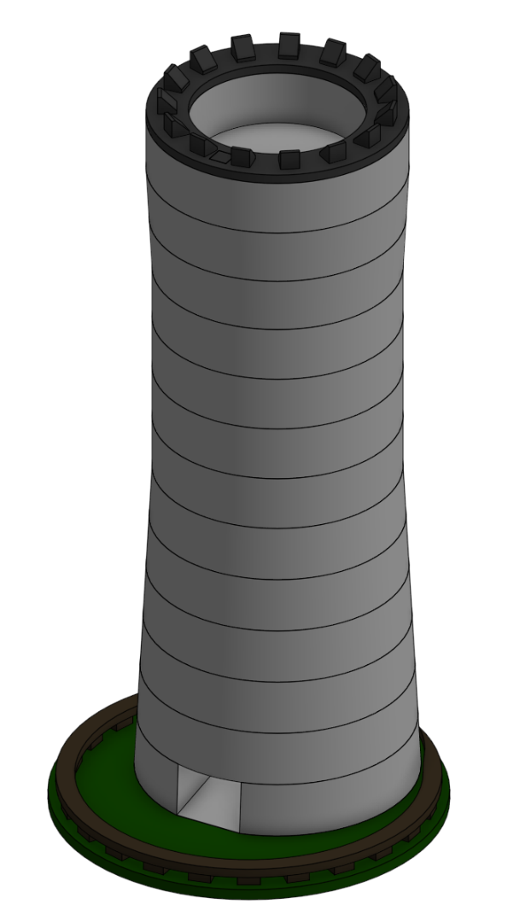

## 1/9/26 - 46

I started on the decorations for the base and the top. I made a courtyard for the tower to sit on, which has a fence that slots into it. The fence can be printed upside down so no supports are required. The top of the tower has a flared top with crenelations. I like the flared top piece, but it has some problems with having the crenellations and not requiring supports, so it may end up being just vertical.

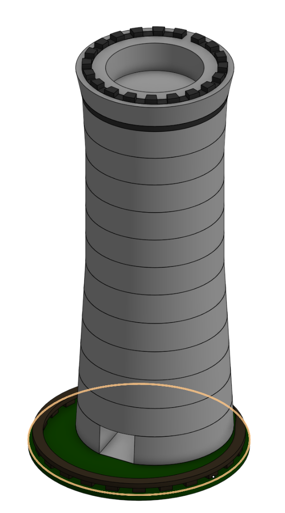

## 1/8/26 - 55

II have completed the internal steps (for the time being at least). I first made the openings int o irregular pentagons, which removed any potential ledges that the dice could get stuck on. I then added a slope to every stair to ensure that the dice won't get stuck inside. I potentially shouldn't have made the bottom and top sloped so I only have to make one modification, but I think this looks better. I did get into a rhythm. The most efficient method I found was to sketch on the upper layer, make a rectangle with one side a construction, and it would be forces to extrude just the slope I wanted. I added a translucent image in hope that it will show my work on the inside better than the cross section.

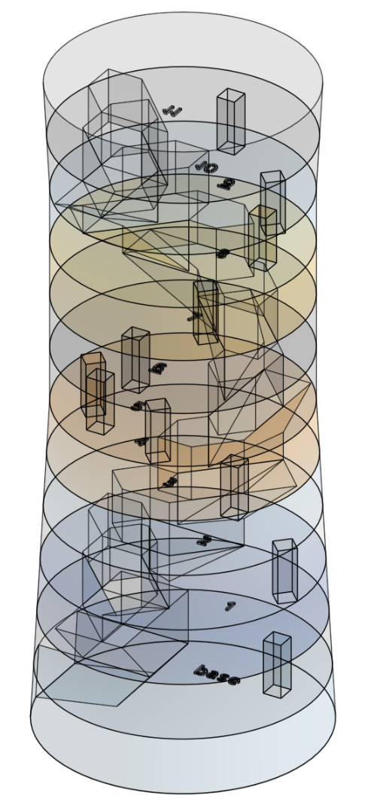

## 1/2/26 - 52

I added the rest of the stairs and slots/pegs to the tower, and made the tower larger. It is hard to see, as they are mostly internal adjustments, but the section view shows the steps a little bit.. The top two sections flare outward, so they are reversed so that they can be printed upside down without supports.

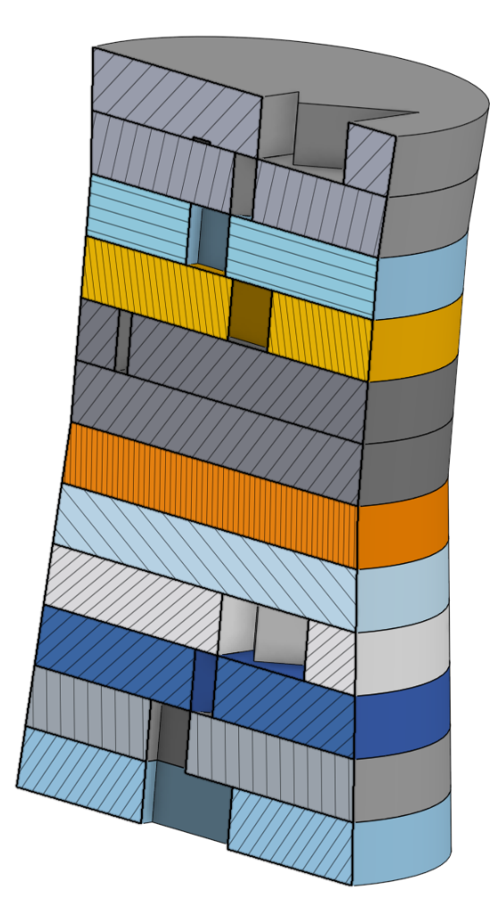

## 1/1/26 - 50

I started creating the dice tower by making a tower of individual rings. This tower is split into sections that slot together, which will hopefully allow it to be printed without any supports. I started adding the stairs for the first few levels; the stairs use a central column for alignment. Each section will also have a number for what level it is to help with assembly, this number will not be seen after the tower is assembled. I spent a lot of time trying to figure out the best shape, angle, and size for the stairs. I currently have the stairs being 38 mm wide, double the width of a normal dice, and they are attached to the corner of the previous step. This will be changed as required during design.

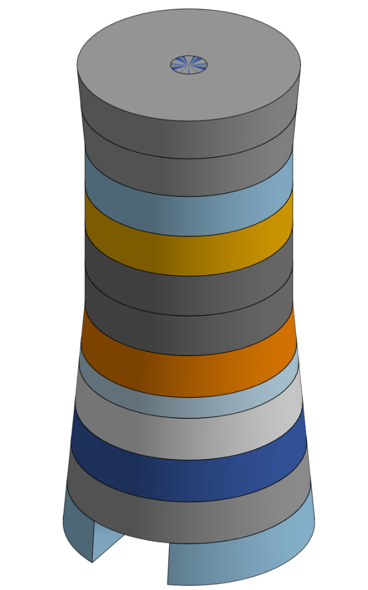

