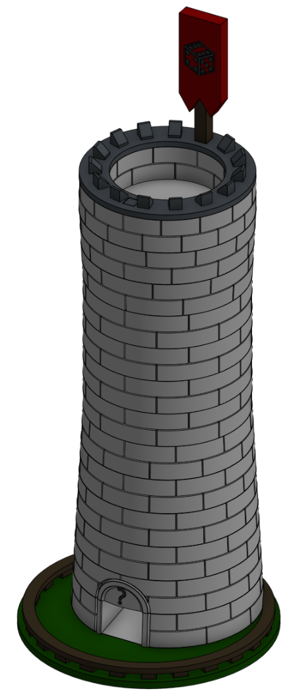

# Tower o' Dice

The rolling machine of randomness. This is a dice tower that can roll standard dice, and is made up of 18 parts. Each piece of the model can be printed without supports if oriented correctly; see the PRINT files in Printable upload for more. info. Each stage of the tower is numbered and will slot into he next layer; the top few layers are upside down when assembled.

Printables: https://www.printables.com/model/1560290-dice-tower

## License
Shield: [![CC BY-SA 4.0][cc-by-sa-shield]][cc-by-sa]

This work is licensed under a
[Creative Commons Attribution-ShareAlike 4.0 International License][cc-by-sa].

[![CC BY-SA 4.0][cc-by-sa-image]][cc-by-sa]

[cc-by-sa]: http://creativecommons.org/licenses/by-sa/4.0/
[cc-by-sa-image]: https://licensebuttons.net/l/by-sa/4.0/88x31.png
[cc-by-sa-shield]: https://img.shields.io/badge/License-CC%20BY--SA%204.0-lightgrey.svg

